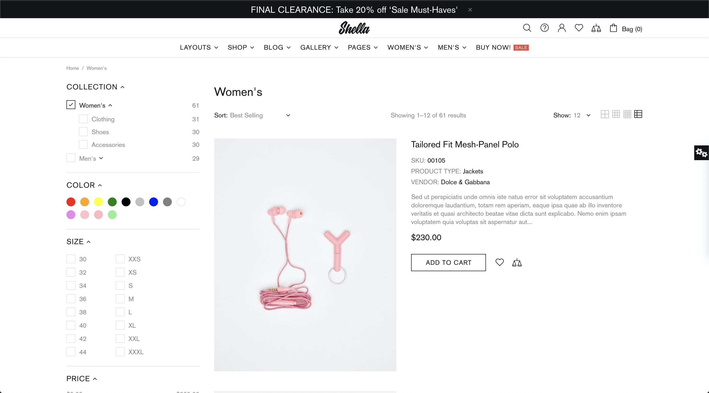
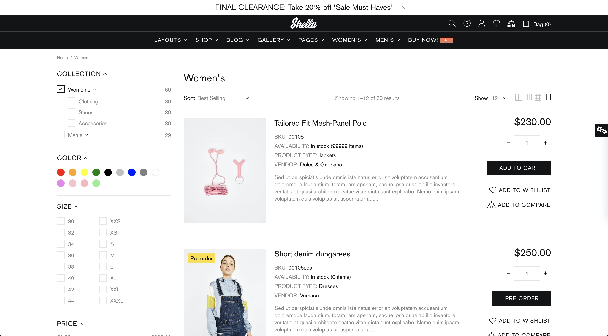

# Product grid


**Collections -> Product grid**



**IMPORTANT!** This section required to save changes by pressing “Save” button in order to view customizations on a collection page.




&#x20;The Sidebar positioning and the visibility settings you can check in the _Theme settings -> Collection Page._ **** How to configure these settings you can read **** [<mark style="color:blue;">**here**</mark>](https://mpithemes.gitbook.io/shella-shopify-theme/theme-settings/collection-page-1#sidebar-visibility)**.**&#x20;

&#x20;**** In this section, you can manage your content for the sidebar by adding the content blocks. There are 9 content blocks available for the sidebar, three of them can be added only once:\
**“Current filters”, “Parameters”** and **“Filters”**. The other six can be added several times: **“Filter settings”, “Tag”, “Products”, “Custom HTML”, “Promo Box (Banner)”** and **“Subscription”**.

## Product grid

&#x20;In this section, you can decide the **“Content width”** that should be displayed on collection pages as “Boxed” or “Fullwidth”:











&#x20;The **“Products per page”** scale from 4 to 24, enables to set the number of products that will be displayed on a collection page:

## Filtering

&#x20;Here you can decide which filter option to use: **“Filters”** or **“Tags”**. **** By default the theme shows filters configured in _Shopify admin -> Navigation -> Collection and search filters_. If you want to show filters by tags (**“Tags”** block) configured in the theme editor - untick the option **“Enable default filtering”**.


**Please note**, only one option can be used in the Sidebar: **“Filters”** or **“Tags”,** the other method will be disabled.


&#x20;**** In this block, one can configure the general settings regarding the **“Filters”** block that will be applied for the filters. How to configure the **“Filters”** block, you can read [<mark style="color:blue;">**here**</mark>](https://mpithemes.gitbook.io/shella-shopify-theme/collections/content/filters).

&#x20;If you enable the option **“Show selected filters counter & button "Reset"”**, the filter counter and the button “Reset” will be shown for each filter block:

&#x20;In order to show the number of products available for each product variant in the Sidebar, enable the option **“Show the count of products on the filter”**:

&#x20;The option **“Hide disabled filters”**, enables one to hide out of stock product variants or to show them as unavailable:

&#x20;Once you enable the option **“Make availability filter as rounded checkbox”,** the **“Availability”** filters design will be changed from the list to rounded checkbox:

&#x20;In the **“Price filter type”** dropdown, you can apply settings for the price filter visibility if to show it as **“Slider & Inputs”**, **“Slider”** or **“Inputs”**.


**Please note**, if the option **“Enable legacy method of the currency conversion”** is enabled in _Theme settings -> Currency_, the only option **“Slider”** can be applied for the price filter.&#x20;


## Sort By

&#x20;This block enables you to show **“Sort by”** option “Only on desktop” or “Desktop and mobile”. Customers will be able to sort products in the collection by featured, best-selling, price ascending, price descending, etc. You may choose an option “Hide” if you do not want to show the “Sort by” option on your store.

## Information

&#x20;Here you can decide if to display the number of the results “Only on desktop” or “Desktop and mobile”. Or set the option “Hide” to disable showing information on the collection page.

## Products count (Unavailable)

&#x20; Here you can choose if to show 'Products count' select by enabling an option “Only on desktop” or “Desktop and mobile”. Or choose “Hide” to disable the option. In this block, one can enable the number of products that should be displayed on one page in the collection. The available values are 6, 12, 18, 24, 48. You can also choose the default number of products that should be displayed on one page in the collection, simply choosing the needed number from the dropdown list in the “Default”.

## Grid

&#x20;In this block, you can decide if to **“Show grid buttons”** on desktop and mobile, or disable an option.

&#x20;The grid view button options will be shown on the collection page: 1 product per row, 2 products per row, 3 products per row, 4 products per row, 6 products per row and list. You can decide whether all of them, some or one should be displayed, simply by enabling the “Show button 1-6 items per row” or “Show button “List”:

**Product 'List' design**

&#x20;**** The theme includes two list designs:












**VIEW DEMO**

<mark style="color:blue;">****</mark>[<mark style="color:blue;">**List products V1**</mark>](https://shella-demo10.myshopify.com/collections/womens)<mark style="color:blue;">****</mark>

****[<mark style="color:blue;">**List products V2**</mark>](https://shella-demo11.myshopify.com/collections/womens)<mark style="color:blue;">****</mark>


#### Enable tooltip

&#x20;If you enable this option, the tooltips will be displayed for the grid buttons on the collection page.

**Default products per row (Extra large)**

&#x20;Here you can choose how many products should be displayed on the extra large screen by choosing the proper option from the dropdown list.

**Default products per row (Large)**

&#x20;Here you can choose how many products should be displayed on the desktop by choosing the proper option from the dropdown list.

**Default products per row (Medium)**

&#x20;Here you can choose how many products should be displayed on the laptop by choosing the proper option from the dropdown list.

**Default products per row (Small)**

&#x20;Here you can choose how many products should be displayed on the tablet by choosing the proper option from the dropdown list.

**Default view grid (Extra small)**

&#x20;Here you can choose how many products should be displayed on the mobile by choosing the proper option from the dropdown list.

## Current filters over the products grid

&#x20;In case you need to show selected filters on desktop, mobile or both, you may choose one of the options from the dropdown list: “Only mobile”, “Only desktop” or “Desktop and mobile”. Or disable the option by choosing “Hide”.


****[<mark style="color:blue;">**VIEW DEMO**</mark>](https://shella-demo12.myshopify.com/collections/womens)<mark style="color:blue;">****</mark>


## Filters section

&#x20;In this block, you can decide whether to display the filter titles in uppercase by enabling the option **“Uppercase filters section title”**. In order to separate each filter block with the border, tick an option **“Show filters section border”**.

&#x20;**** This is how a collection page may look like when one enables both of these options:&#x20;

