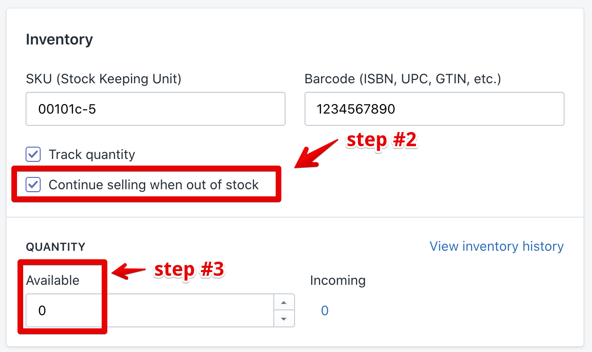

# Pre Order

&#x20;Your product should have two options to show as “Pre order”:

1\) Go to: _Shopify admin panel -> Products -> Edit the required product_

2\) Configure the inventory. Enable the “Continue selling when out of stock” option

3\) Set quantity to 0&#x20;


****[<mark style="color:blue;">**VIEW DEMO**</mark>](https://shella-demo.myshopify.com/products/grown-cotton-t-shirt-with-print)<mark style="color:blue;">****</mark>


&#x20;If you need to show the “Pre order” label, enable the option in _Theme settings ->_

\-> _Product -> Collection page_ for collection pages;

\-> _Product page & Quick view_ for product pages.
