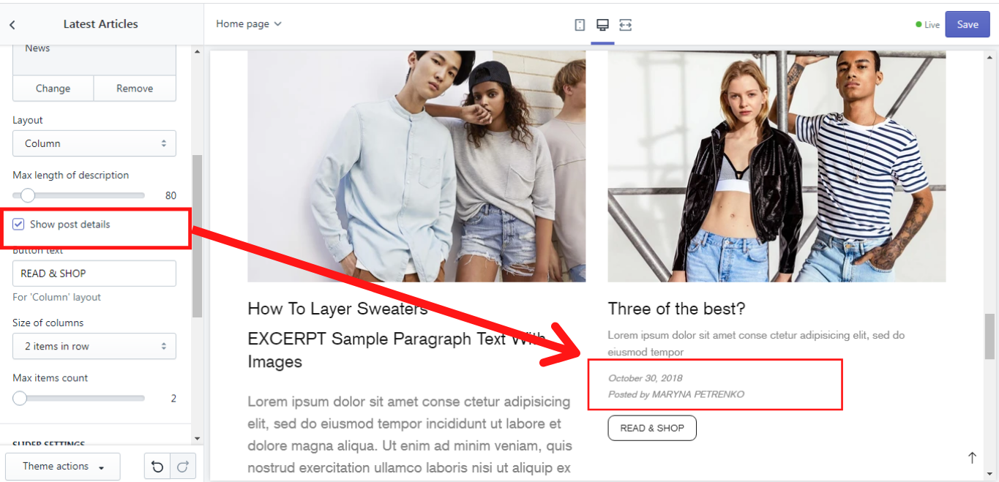
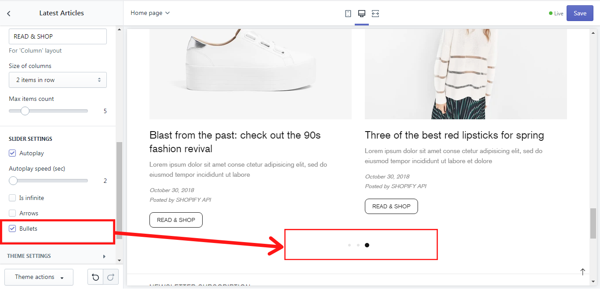

# Article carousel


**Add section -> Article carousel**


## Article carousel

### Title

&#x20; You can add a **Title** for this section and it will be displayed on the home page, e.g.: “Latest Articles”.

## General

### Blog

&#x20;Here you just need to select the blog page, which content should be displayed on the home page. How to manage a blog you can read [<mark style="color:blue;">**here**</mark>](https://help.shopify.com/en/manual/online-store/legacy/blogs).

### Layout

&#x20;Here you can choose how the article’s content should be positioned: in a row, in a column, or centered in the column.

### Max length of the description

&#x20;This scale enables you to set the maximum length of the article’s content that should be displayed in the article carousel. You can make changes on this scale for the articles, that do not have an excerpt. Once the article has an excerpt the settings of this scale will be ignored. How to check whether your articles have an excerpt? Go to your _Shopify Admin -> Online Store -> Blog posts_. Then click on any blog post and check it:&#x20;

.png>)

### Show post details

&#x20;If at the end of each article you want to see the date of its posting and it's author, you can enable the option **“Show post details”:**&#x20;

### Button text

&#x20;The layouts “Column” and “Centered in the column” allow you to add the button text in the field **“Button text”.**

### Size of the columns

&#x20;In **“Size of the columns”** you can decide how many articles should be shown in one row. Simply choose the needed option from the dropdown list.

### Max items count

&#x20;The **“Max items count”** scale allows you to set the maximum of the articles that should be displayed. If this number is bigger than the one you have set in the “Size of the columns” the articles will be displayed in a carousel and will be changed one slider after another one.

## Slider Settings 

&#x20;Here you can enable an **“Autoplay”** for the article’s sliders and set its speed on the **“Autoplay speed (sec)”** scale from 2 to 10 seconds. You can also choose whether **Arrows** or **Bullets** should be displayed when the sliders change, simply by enabling one or all of these options. If you enable **“Is infinite”** , the article’s carousel will be infinite. If you disable this option, the carousel will stop, once it shows the last articles.&#x20;

