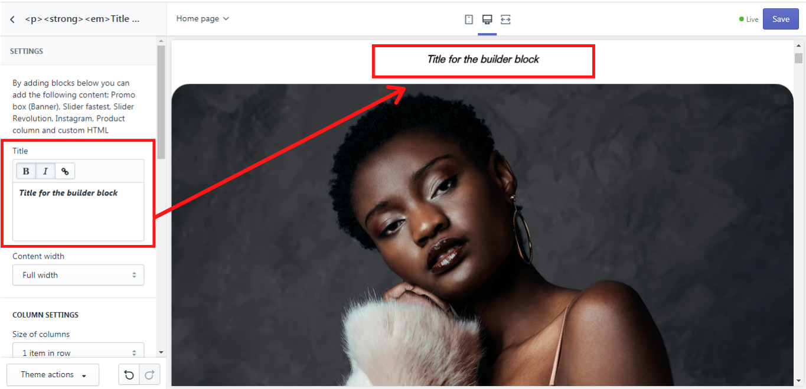
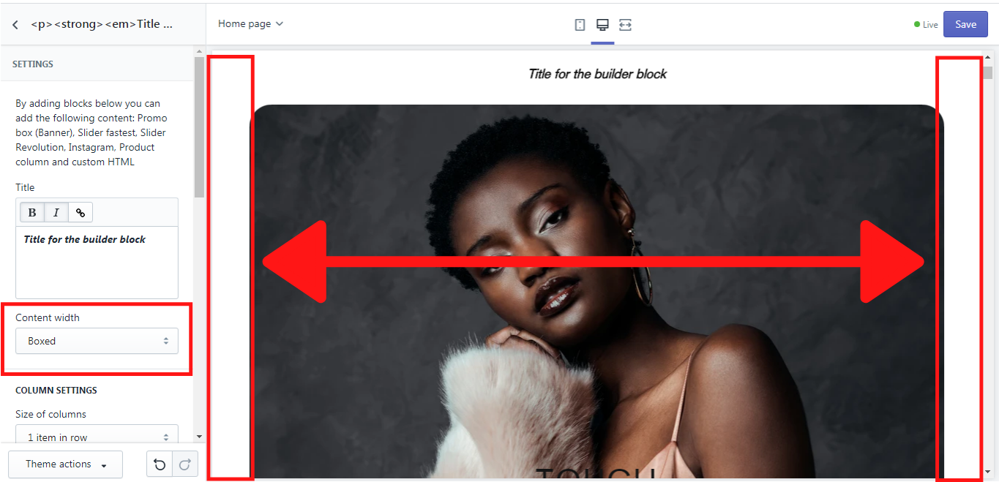
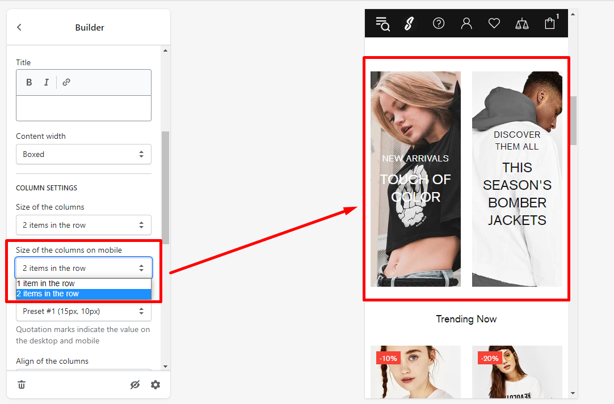
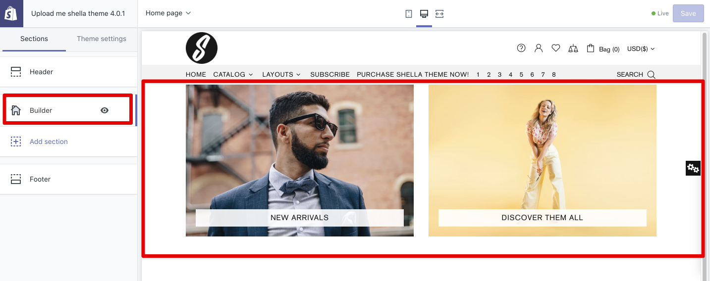
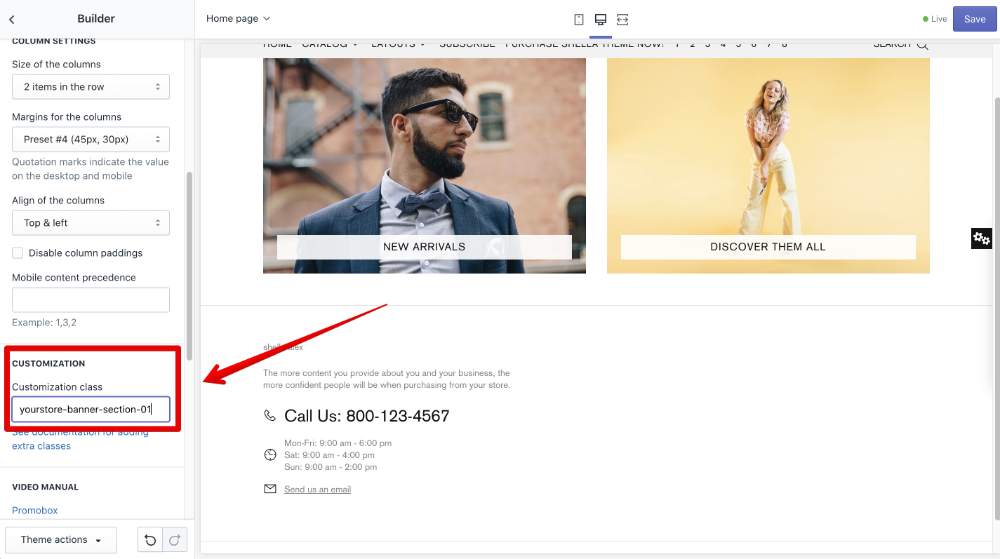
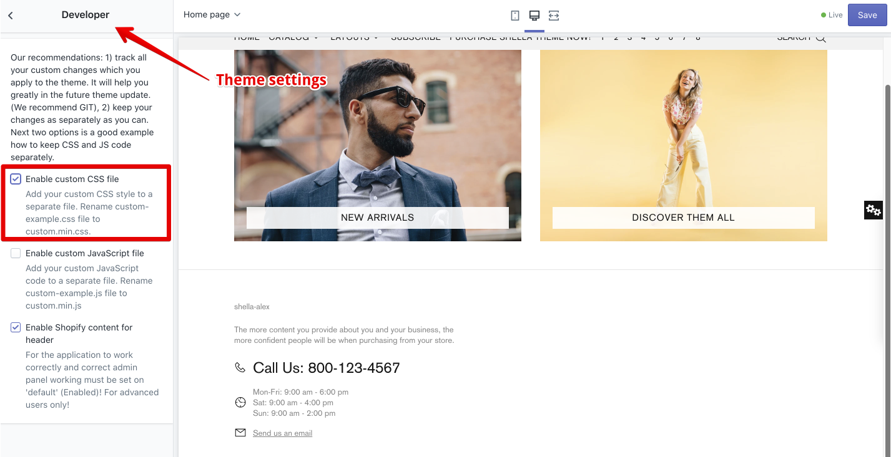
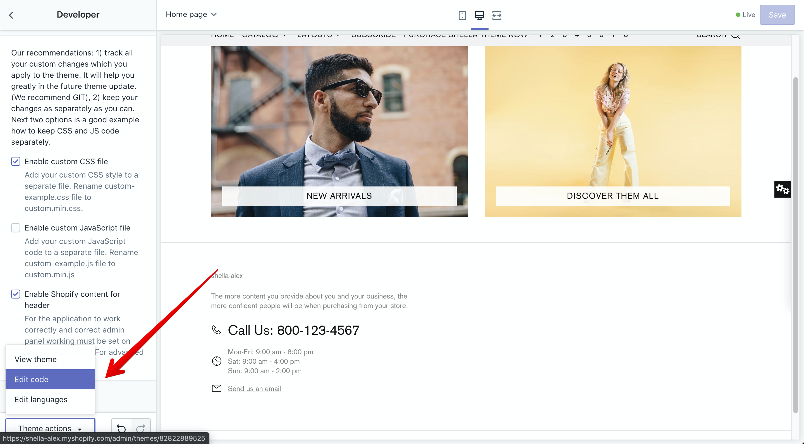
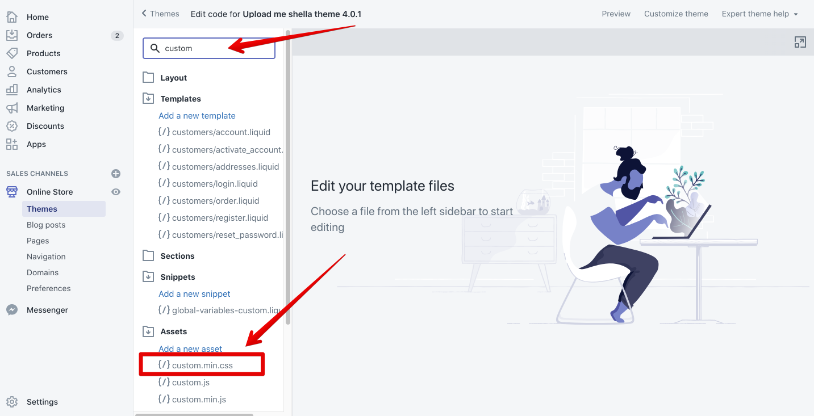
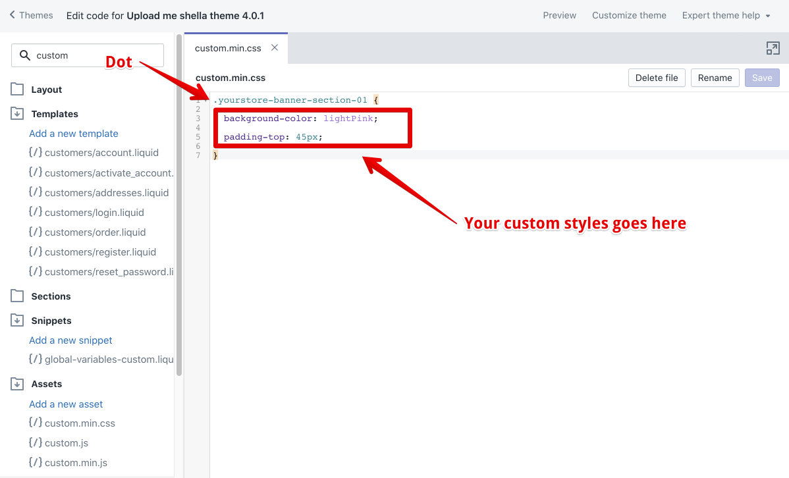
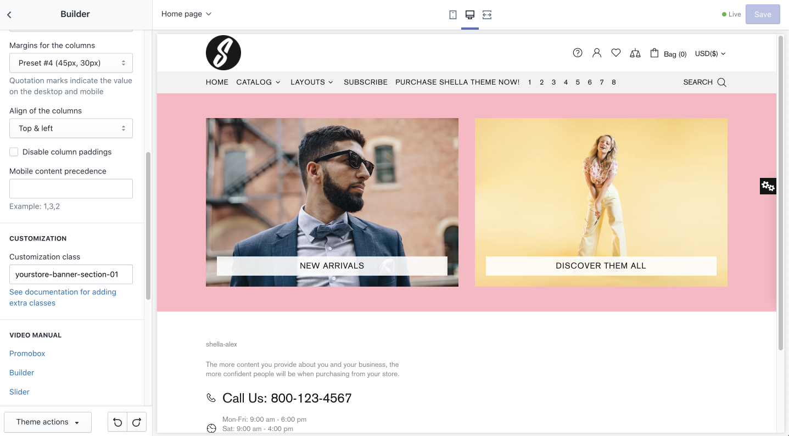

# Builder


**Add section -> Builder**




&#x20;The “Builder” section on the Home page is a massive section, which allows you to add different content blocks, such as promo box (banners), various sliders, pages, product columns, videos, space for vertical menu, etc. This section can be added to any place on the home page, either straight after the header or before the footer, etc. We will get deeper into each of these blocks in the next sections.

## Builder

&#x20;In this section, you can configure the settings for all content blocks.

### Title

&#x20;Here you can add a **Title** for your builder section, which will be shown on the page. You can customize it's font and add a link if needed:&#x20;

### Content width

&#x20;This option enables you to choose the width of the content. It may be either full or boxed. If it is full the image of this section is displayed in full width on the home page. Once it is boxed, you will see some space between the image and the home page on the left and right sides. In our example, we will show you the boxed width of the content:&#x20;

## Column Settings 

&#x20; Here you can choose how many items should be shown in one row on desktop, using a dropdown menu **“Size of the columns”**.

&#x20; The option **“Size of the columns on mobile”** allows you to set the number of items in the row on mobile: “1 item in the row” or “2 items in the row”.  In our example, we will show you “2 items in the row”:&#x20;

&#x20;In the dropdown list of **“Margins for the columns”**, you can choose the type of the margins for the columns.\
&#x20;The position of the columns can also be set in this section. Just use a dropdown list of the **”Align of columns”** and select the proper option.\
&#x20;The option **“Disable column paddings”** allows you to remove space between the columns in the builder section.\
&#x20;In the **“Mobile content precedence”** you can decide in which order the content blocks should be displayed in the mobile version, by writing the order, e.g.: “2,1,3”.

## Customization 


**Please note**, this is an advanced option, you should have developer skills to work with CSS styles, or hire a developer to complete this task for your store.


### **Customization class**

&#x20; You may add a custom CSS class to the Builder section. It helps if you need to apply custom changes.

&#x20; Add Builder section, add content, configure the section.&#x20;

&#x20;In case you need to add additional style, you may use the **customization class** option.


**Please note**, the customization class should be unique, it may include the Latin letters, numbers and dashes. Spaces and other chars are not allowed. &#x20;


&#x20;Enable the **custom.css** file at the _Theme settings -> Developer_&#x20;

&#x20;Open the source file editor at the _Theme actions -> Edit code_&#x20;

&#x20;Find and open the **assets/custom.min.css** file:

&#x20;Add your custom CSS class and custom styles.

&#x20;The example code shows how to add a background color and top padding.

&#x20;[<mark style="color:blue;">**Read more information about the CSS**</mark>](https://www.w3schools.com/css/)<mark style="color:blue;">****</mark>


**Please note,** if you see the **CSS** term for the first time, you should hire a person who is familiar with it. &#x20;


&#x20;The result.&#x20;

