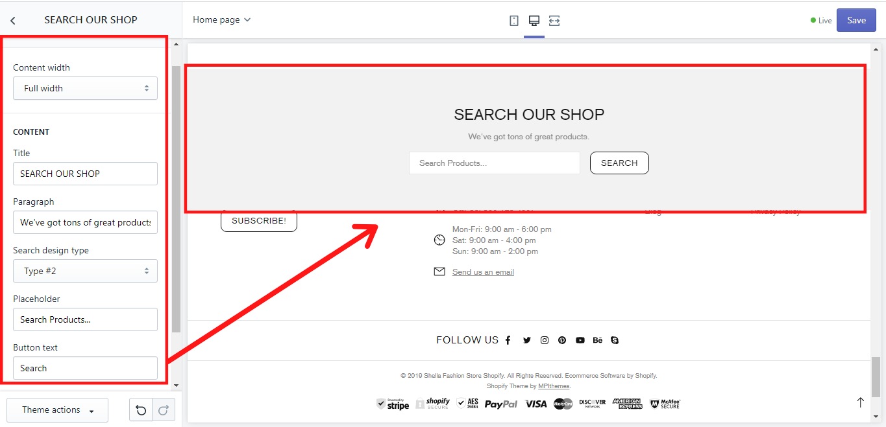

# Search form


**Add section -> Search form**


## Image and text

### Content width

&#x20;In the section “Search form” you can choose the width of the content in **“Content width”**. It may be either full or boxed.&#x20;

## Content

&#x20;In the **“Title”** write the title of the search form. In the **“Paragraph”** write the information text. Then choose the design of the search form in the **“Search design type”**, where 2 types are available. In the **“Placeholder”** you can write a text if such need arises. In the **“Button text”** you can write the name of the button. The button is available for the design type #2 only.

&#x20;This is an example of the search form:

