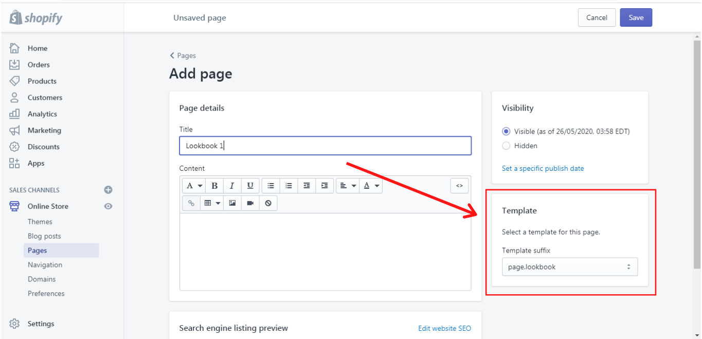

# Lookbook


**Pages -> lookbook-> Lookbook**



**IMPORTANT!** In order to make your Product page more attractive to buyers, add various sections by pressing **“Add section”**. The theme includes different content sections for a Product page, such as [<mark style="color:blue;">**Builder**</mark>](https://mpithemes.gitbook.io/shella-shopify-theme/home-page-sections/builder), [<mark style="color:blue;">**Article carousel**</mark>](https://mpithemes.gitbook.io/shella-shopify-theme/home-page-sections/article-carousel), [<mark style="color:blue;">**Brand Carousel**</mark>](https://mpithemes.gitbook.io/shella-shopify-theme/home-page-sections/brand-carousel),[ <mark style="color:blue;">**Product Carousel**</mark>](https://mpithemes.gitbook.io/shella-shopify-theme/home-page-sections/product-carousel), [<mark style="color:blue;">**Review Carousel**</mark>](https://mpithemes.gitbook.io/shella-shopify-theme/home-page-sections/review-carousel), [<mark style="color:blue;">**Contact Form**</mark>](https://mpithemes.gitbook.io/shella-shopify-theme/home-page-sections/contact-form), [<mark style="color:blue;">**FAQ's**</mark>](https://mpithemes.gitbook.io/shella-shopify-theme/home-page-sections/faqs), [<mark style="color:blue;">**Gallery**</mark>](https://mpithemes.gitbook.io/shella-shopify-theme/home-page-sections/gallery), [<mark style="color:blue;">**Information line**</mark>](https://mpithemes.gitbook.io/shella-shopify-theme/home-page-sections/information-line), <mark style="color:blue;"></mark> [<mark style="color:blue;">**Search Form**</mark>](https://mpithemes.gitbook.io/shella-shopify-theme/home-page-sections/search-form), [<mark style="color:blue;">**Subscription form**</mark>](https://mpithemes.gitbook.io/shella-shopify-theme/home-page-sections/subscription-form), [<mark style="color:blue;">**Collections**</mark>](https://mpithemes.gitbook.io/shella-shopify-theme/home-page-sections/collections), [<mark style="color:blue;">**Lookbook**</mark>](https://mpithemes.gitbook.io/shella-shopify-theme/lookbook), [<mark style="color:blue;">**One product**</mark>](https://mpithemes.gitbook.io/shella-shopify-theme/home-page-sections/one-product), **Slider Revolution**, [<mark style="color:blue;">**Spacer**</mark>](https://mpithemes.gitbook.io/shella-shopify-theme/home-page-sections/spacer). How to configure each of them you can read [<mark style="color:blue;">**here**</mark>](https://mpithemes.gitbook.io/shella-shopify-theme/home-page-sections).




## Lookbook

&#x20;Here you can change the main settings for the lookbook. If you want to have a title of the lookbook displayed on the page, enable the option **“Show title”**. In the **“Layout”** you can choose one of the two possible layouts for the lookbook on a desktop view:












**VIEW DEMO**

****[<mark style="color:blue;">**Look Book V1**</mark>](https://shella-demo.myshopify.com/pages/lookbook)<mark style="color:blue;">****</mark>

****[<mark style="color:blue;">**Look Book V2**</mark>](https://shella-demo2.myshopify.com/pages/autumn-winter-2018)<mark style="color:blue;">****</mark>


&#x20;In the **“Products per row” (Extra large)** you can choose how many products should be displayed in one row: 2, 3 or 4.&#x20;


**Please note,** the layout and image display settings can be applied only for a desktop mode. It will be shown one item in a row on mobile by default.


&#x20;This is how it may look like on mobile:

.png>)

&#x20;In the **“Responsive size”** you can write the size of the image from 1 to 12 for different screen sizes. Where each value assigned to the different screen size (Extra large, Large, Medium, Small, Extra small).

&#x20;This is an example of the Lookbook page, for which we have added 6 "Image" blocks and set the “Responsive size” half of a line both for desktop and mobile view.

Desktop view:

.png>)

Mobile view:

.png>)

&#x20;On the **“Image size”** scale from 200 to 1000px, you can set the quality of the image.

## Theme Blocks

## **Image**

&#x20;Here you can add content to your lookbook by adding the blocks **“Image”**. You can add as many “Image” blocks in the content as you wish. It depends on how many images you want to have in your lookbook. Make sure that you have created a lookbook page in your Shopify Admin first. How to add and edit a page you can read [<mark style="color:blue;">**here**</mark>](https://mpithemes.gitbook.io/shella-shopify-theme/get-started/how-to-add-and-edit-a-page).&#x20;


**Please note**, when creating a lookbook page, you need to choose the **template suffix “page.lookbook”** in the Template:


&#x20; In the **“Image”** you can select the image of the products on the models.

## **Product**

&#x20;In this block, you can add the products with their information. In the **“Product”** select the product. Then **** choose the image to which you want to order this product.


**Please note,** the Shopify functionality can not display more than 20 products from different collections as shown in Look Book. &#x20;


&#x20;It was added the manual filling of the product block (**“Product image”, “Product title”, “Product price”, “Product compare at price”**) for those products that cannot be displayed due to 20 product’s limit. This information can be changed for each product up to limit.

&#x20;This is how it may look like in the Look book:

&#x20;On the **“Horizontal position”** and **“Vertical position”** scales from 0 to 100% you can order the position of the products displayed on the image. The products will be shown as dots at which one can click and see the product details. This option is available for the **“Layout #1”** only.
