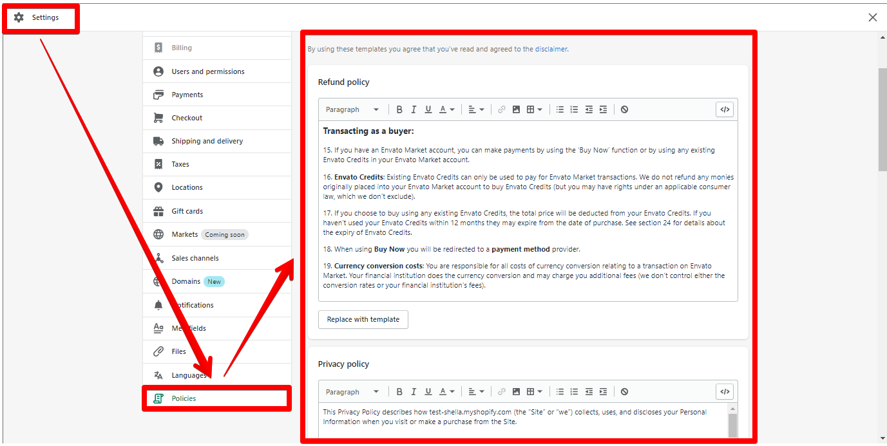
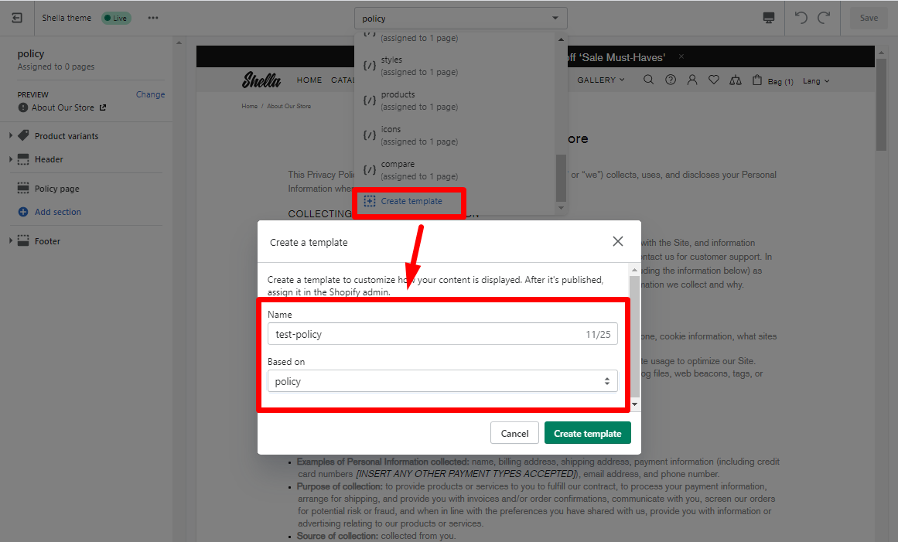

# Policy page


**Pages -> policy -> Policy page**



**IMPORTANT!** In order to make your Product page more attractive to buyers, add various sections by pressing **“Add section”**. The theme includes different content sections for a Product page, such as [<mark style="color:blue;">**Builder**</mark>](https://mpithemes.gitbook.io/shella-shopify-theme/home-page-sections/builder), [<mark style="color:blue;">**Article carousel**</mark>](https://mpithemes.gitbook.io/shella-shopify-theme/home-page-sections/article-carousel), [<mark style="color:blue;">**Brand Carousel**</mark>](https://mpithemes.gitbook.io/shella-shopify-theme/home-page-sections/brand-carousel),[ <mark style="color:blue;">**Product Carousel**</mark>](https://mpithemes.gitbook.io/shella-shopify-theme/home-page-sections/product-carousel), [<mark style="color:blue;">**Review Carousel**</mark>](https://mpithemes.gitbook.io/shella-shopify-theme/home-page-sections/review-carousel), [<mark style="color:blue;">**Contact Form**</mark>](https://mpithemes.gitbook.io/shella-shopify-theme/home-page-sections/contact-form), [<mark style="color:blue;">**FAQ's**</mark>](https://mpithemes.gitbook.io/shella-shopify-theme/home-page-sections/faqs), [<mark style="color:blue;">**Gallery**</mark>](https://mpithemes.gitbook.io/shella-shopify-theme/home-page-sections/gallery), [<mark style="color:blue;">**Information line**</mark>](https://mpithemes.gitbook.io/shella-shopify-theme/home-page-sections/information-line), <mark style="color:blue;"></mark> [<mark style="color:blue;">**Search Form**</mark>](https://mpithemes.gitbook.io/shella-shopify-theme/home-page-sections/search-form), [<mark style="color:blue;">**Subscription form**</mark>](https://mpithemes.gitbook.io/shella-shopify-theme/home-page-sections/subscription-form), [<mark style="color:blue;">**Collections**</mark>](https://mpithemes.gitbook.io/shella-shopify-theme/home-page-sections/collections), [<mark style="color:blue;">**Lookbook**</mark>](https://mpithemes.gitbook.io/shella-shopify-theme/lookbook), [<mark style="color:blue;">**One product**</mark>](https://mpithemes.gitbook.io/shella-shopify-theme/home-page-sections/one-product), **Slider Revolution**, [<mark style="color:blue;">**Spacer**</mark>](https://mpithemes.gitbook.io/shella-shopify-theme/home-page-sections/spacer). How to configure each of them you can read [<mark style="color:blue;">**here**</mark>](https://mpithemes.gitbook.io/shella-shopify-theme/home-page-sections).


&#x20;**In order to create a new policy page you can follow these steps:**

**Step 1**

&#x20;Make sure that you created legal pages in _Shopify Admin -> Settings -> Policies_:

How to add or generate store policies, you can read [<mark style="color:blue;">**here**</mark>](https://help.shopify.com/en/manual/checkout-settings/refund-privacy-tos).

**Step 2**

&#x20;Navigate to _Shella Editor -> Pages -> Create template_. In the **“Name”**, paste a title of the template and select the template **“policy”** in the **“Based on”** dropdown:

Press “Create template”.

**Step 3**

&#x20;Go to _Shopify Admin -> Online store -> Pages -> Add page_ and create a new page. How to add and edit a page you can read [<mark style="color:blue;">**here**</mark>](https://mpithemes.gitbook.io/shella-shopify-theme/get-started/how-to-add-and-edit-a-page). Then select created **“Theme template”**:

Save changes.

**Step 4**

&#x20;Go to your _Shella Editor -> Pages -> select the page,_ for e.g.  “test-policy”. **** In the **“Page type”** dropdown, choose the policy which will be displayed on the page:

