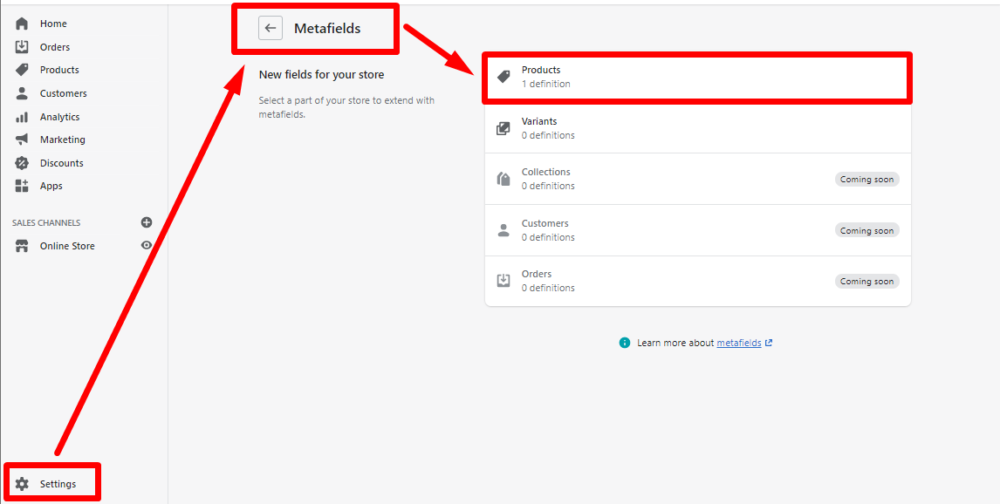
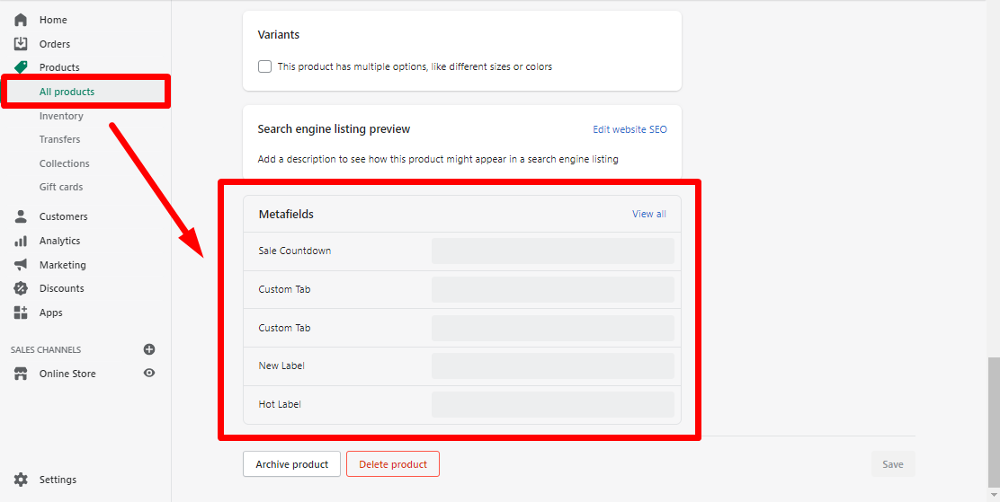
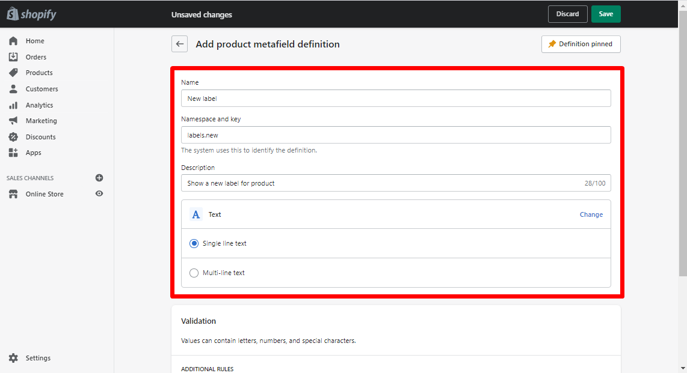

# Product Metafields


**IMPORTANT!** No capital letters are allowed in the namespace and key fields!



**IMPORTANT!**

&#x20;**** If you use the theme version 4.12.0 or higher, you can customize Metafileds in your _Shopify admin -> Settings -> Metafields -> Products_. Check this [<mark style="color:blue;">**video tutorial**</mark>](https://www.youtube.com/watch?v=u7xcBE9MVUY\&list=PLj-506KaR\_vcQjwcpC6yII-1JY0bSj7df\&index=35).

&#x20;If you use the lowest theme versions, please consider to install an app, for e.g. a free Metafields Guru app. Check the [<mark style="color:blue;">**video tutorial**</mark>](https://www.youtube.com/watch?v=7qQNZudcstY\&list=PLj-506KaR\_vcQjwcpC6yII-1JY0bSj7df\&index=33) for more information.


## Shopify admin

&#x20; You can add metafields to products from your Shopify admin.


**Please note**, if previously you customized metafields via app, this method will not work. You need to remove all metafields in the app before to start configurations in your Shopify admin.


&#x20;**How to add metafields to your products from Shopify admin:**

* Add a Meta field format in _Shopify admin -> Settings -> Metafields -> Products :_

* Press “Add definition” and fill in the fields. Save changes.
* In _Shopify admin -> Products -> All products -> Metafileds_, add the value to the field. Save changes.

### Labels

&#x20;You can add two labels via Metafields: “New” and “Hot”.

Step 1

&#x20; Enable labels “New” and “Hot” in _Theme settings ->_\
&#x20;_->_ [_<mark style="color:blue;">**Product -> Collection Page**</mark>_](https://mpithemes.gitbook.io/shella-shopify-theme/theme-settings/collection-page#labels) (for Collection pages/Collections)\
&#x20;_->_ [_<mark style="color:blue;">**Product Page & Quick View**</mark>_** ** ](https://mpithemes.gitbook.io/shella-shopify-theme/theme-settings/product-page-and-quick-view#show-label-new)(for Product pages)

Step 2

&#x20;__ Meta field format for a label “New”:

* Name = e.g. **New label**
* Namespace and key = **labels.new**
* Description = your text
* Select content type -> Text -> Single line text
* Value = **true**

Meta field format for a label “Hot”:

* Name = e.g. **Hot label**
* Namespace and key = **labels.hot**
* Description = your text
* Select content type -> Text -> Single line text
* Value = **true**

### **Sale Countdown**

&#x20;The Sale Countdown will be shown for the product in Collection page and Quick view popup, Product page.

Step 1

&#x20;Set the “Compare at price” in _Shopify admin -> Products_

Step 2

&#x20;Enable an option “Show countdown” in _Theme settings ->_\
&#x20;\-> _****_ [_<mark style="color:blue;">**Product -> Collection Page**</mark>_](https://mpithemes.gitbook.io/shella-shopify-theme/theme-settings/collection-page#elements) (for Collection pages/Collections)\
&#x20;\-> _****_ [_<mark style="color:blue;">**Product Page & Quick View**</mark>** **_ ](https://mpithemes.gitbook.io/shella-shopify-theme/theme-settings/product-page-and-quick-view#show-countdown)(for Product pages)

Step 3

&#x20;Add the Meta field format:

* Name = e.g. **Sale Countdown**
* Namespace and key = **countdown.date**
* Description = your text
* Select content type -> Text -> Single line text
* Value = e.g. 11 November 2021 20:30 or 2021-11-11 20:30 (date string)

### Size guide

&#x20;Create the unique “Size guide” for each product via Metafields.

Step 1

Enable an option “Size guide” in _Theme settings ->_ [_<mark style="color:blue;">**Product Page & Quick View**</mark>_ ](https://mpithemes.gitbook.io/shella-shopify-theme/theme-settings/product-page-and-quick-view#show-button-size-guide)(for Product pages)

Step 2

&#x20;Meta field format:

* Name = e.g. **Size Guide**
* Namespace and key = **sizeguide.html**
* Description = your text
* Select content type -> Text -> Single line text
* Value = your HTML code

You may find the example HTML code from demo store [<mark style="color:blue;">**here**</mark>](https://mpithemes.gitbook.io/shella-shopify-theme/theme-settings/product-page-and-quick-view#show-button-size-guide).

### Hide 'Size Guide' popup per product

&#x20;If you have already added the Meta field format for “Size guide”:

* Name = e.g. **Size Guide**
* Namespace and key = **sizeguide.html**

&#x20;You may simply paste the value for a product:

* Value = **hide**

### Custom Tab

You can create four unique tabs. Use the **tab**, **tab1**, **tab2** or **tab3** namespace per each tab. Add two metafields for the tab.

&#x20;Meta field format #1:

* Name = e.g. **Custom Tab**
* Namespace and key = **tab.title (tab1.title, tab2.title, tab3.title)**
* Description = your text
* Select content type -> Text -> Single line text
* Value = your title for the tab

&#x20;Meta field format #2:

* Name = e.g. **Custom Tab**
* Namespace and key = **tab.content**
* Description = your text
* Select content type -> Text -> Single line text
* Value = your HTML code

## Metafields Guru app

&#x20;Now let's take a deep look at how to customize each meta field in the app:

### Labels

&#x20;You can add two labels via Metafields: “New” and “Hot”.

Step 1

&#x20; Enable labels “New” and “Hot” in _Theme settings ->_\
&#x20;_->_ [_<mark style="color:blue;">**Product -> Collection Page**</mark>_](https://mpithemes.gitbook.io/shella-shopify-theme/theme-settings/collection-page#labels) (for Collection pages/Collections)\
&#x20;_->_ [_<mark style="color:blue;">**Product Page & Quick View**</mark>_<mark style="color:blue;">** **</mark><mark style="color:blue;">****</mark> ](https://mpithemes.gitbook.io/shella-shopify-theme/theme-settings/product-page-and-quick-view#show-label-new)(for Product pages)

Step 2

&#x20;The Meta field format for a label “New”:

* Type = **Single line text**
* Namespace = **labels**
* Key = **new**
* Value = **true**

&#x20;The Meta field format for a label “Hot”:

* Type = **Single line text**
* Namespace = **labels**
* Key = **hot**
* Value = **true**

### Sale Countdown

&#x20;The Sale Countdown will be shown for the product in Collection page and Quick view popup, Product page.

Step 1

&#x20;Set the “Compare at price” in _Shopify admin -> Products_

Step 2

&#x20;Enable an option “Show countdown” in _Theme settings ->_\
&#x20;\-> _<mark style="color:blue;">****</mark>_ [_<mark style="color:blue;">**Product -> Collection Page**</mark>_](https://mpithemes.gitbook.io/shella-shopify-theme/theme-settings/collection-page#elements) (for Collection pages/Collections)\
&#x20;\-> _****_ [_<mark style="color:blue;">**Product Page & Quick View**</mark>** **_ ](https://mpithemes.gitbook.io/shella-shopify-theme/theme-settings/product-page-and-quick-view#show-countdown)(for Product pages)

Step 3

&#x20;Add the Meta field format:

* Type = **Single line text**
* Namespace = **countdown**
* Key = **date**
* Value = **2021-12-15 22:17:15** (date string)

### Size guide

&#x20;Create the unique “Size guide” for each product via Metafields.

Step 1

Enable an option “Size guide” in _Theme settings ->_ [_<mark style="color:blue;">**Product Page & Quick View**</mark>_ ](https://mpithemes.gitbook.io/shella-shopify-theme/theme-settings/product-page-and-quick-view#show-button-size-guide)(for Product pages)

Step 2

&#x20;Meta field format:

* Type = **Single line text**
* Namespace = **sizeguide**
* Key = **html**
* Value = **\[ Your HTML code ]**

&#x20;You may find the example HTML code from demo store [<mark style="color:blue;">**here**</mark>](https://mpithemes.gitbook.io/shella-shopify-theme/theme-settings/product-page-and-quick-view#show-button-size-guide).

### Hide 'Size Guide' popup per product

&#x20;If your store has different types of products and you may need to hide size guide popup for some products.

&#x20;You may configure it with 'hide' value.

&#x20;Meta field format:

* Type = **Single line text**
* Namespace = **sizeguide**
* Key = **html**
* Value = **hide**

### Custom Tab

&#x20;If you want to add a unique Tab for each product, you can achieve it via Metafields.

&#x20;You can create four unique tabs. Use the **tab**, **tab1**, **tab2** or **tab3** namespace per each tab.

&#x20;Add two metafields for the tab.

&#x20;Meta field format #1:

* Type = **Single line text**
* Namespace = **tab** (tab1, tab2, tab3)
* Key = **content**
* Value = **\[Your HTML code]**

&#x20;Meta field format #2:

* Type = **Single line text**
* Namespace = **tab** (tab1, tab2, tab3)
* Key = **title**
* Value = **Tab title string**

