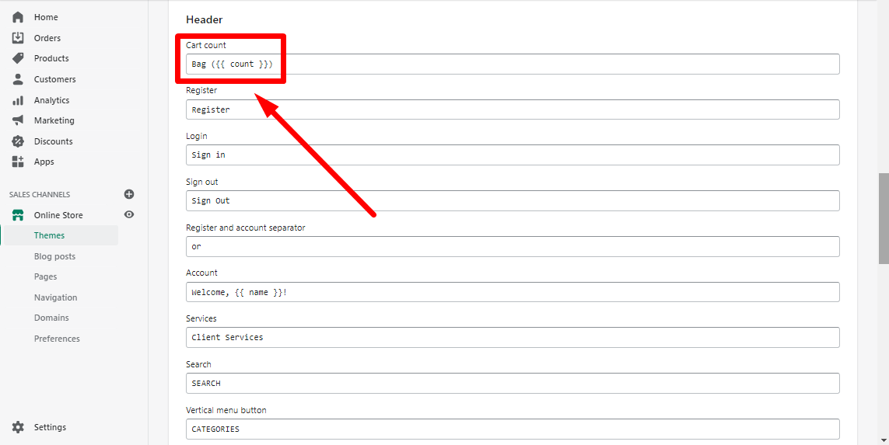

# Cart


**Theme settings -> Cart**


## General

### **Show header button**

&#x20;This option allows you to decide whether a **“Cart”** button should be shown in the header:

.png>)

&#x20;The text of a “Cart” button can be changed by following these steps:

* Go to your _Shopify Admin -> Online store -> Actions_;
* Click on Edit languages;
* Press a tab “Layout” and scroll down to the "Header" block ;
* Start editing your content.

This is how it looks like:

### **Add to cart and stay on the page (AJAX)**

&#x20;If you enable this option, the customer will not be redirected to the cart page every time, when he or she adds a new product to the cart. A **“Cart”** popup will appear showing all products, which the client has already added to the cart.

### **Icon for a 'Cart' button**

&#x20;In this section, you have the possibility to change the icon for the “Сart” button using a snippet for an icon, which you can find **** [<mark style="color:blue;">**here**</mark>](https://shella-demo.myshopify.com/pages/icons).

## Popup

### **Enable popup**

&#x20;If this option is disabled the client will be redirected to the cart page. If you enable this option, the “My bag” - popup will appear when clicking on the cart:

.png>)

### **Show quantity input**

&#x20;If you enable this option, the product’s quantity input will be shown inside the cart popup under each product:

.png>)

## Cart page

&#x20;In this section you can decide, whether a vendor or the client´s notes should be shown under the product on the cart page:

## Free shipping progress bar



### **Enable bar**

&#x20;If you enable this option, a free shipping progress bar will be shown at the end of the cart page.

### **Free shipping value**

&#x20;Here you can set a free shipping value. Set a free shipping limit in cents. If you offer free shipping on orders more than 50 USD, set 5000 here. Once the client adds products to a cart with a total price greater than or equal to 50 USD, a free shipping progress bar will appear at the end of the cart page, if you enabled this bar above.

**Multi currency**

&#x20;Set a free shipping values for different currencies, using the separator “|”.

&#x20;For e.g., if you use three currencies for your store. You can add three values according to the list of currencies in the dropdown menu:

.png>)

## Shipping Rates Calculator

Here you can enable or disable a shipping rates calculator:

.png>)

### **Default country selection**

&#x20;Here you can write a country, which should be shown as a default delivery country when calculating the shipping rates.

&#x20;**Example:** If your store is in United States and your main customers are from United States, then write “United States” and it will be shown automatically in the dropdown list when calculating the delivery rates. Of course, if your store offers delivery to different countries, the clients can choose any other country from the list, but the default (main one) will be United States in this example:

.png>)
