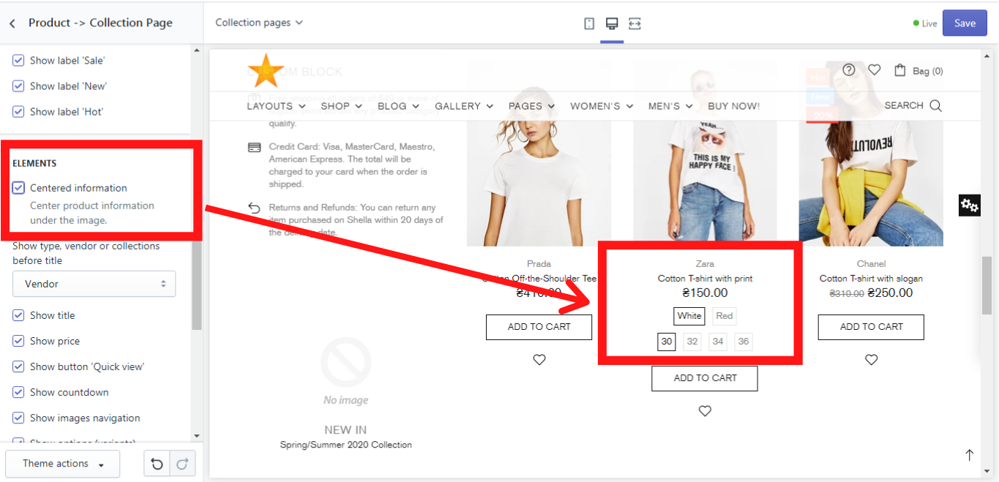
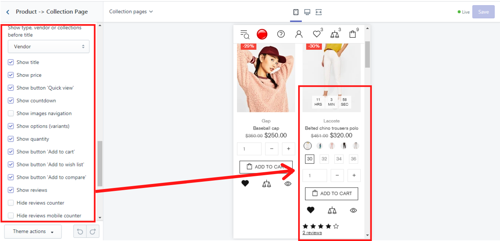
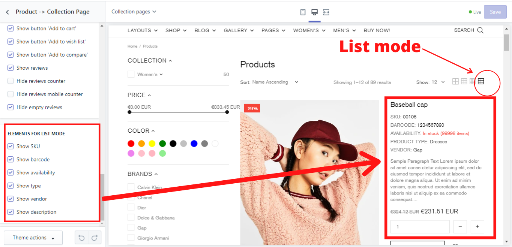

# Product -> Collection Page


**Theme settings -> Product -> Collection Page**




## Image

### **Image height (in % of the width)**

&#x20;Here you have a zoom slider (with the scale from 50% to 150%) where you can decide what height (in % of the width) your image will have on the collection page.

Here are the examples of some variants:

Less than 100 - landscape.

100 - square image.

More than 100 - portrait.


**Please note**, this option doesn't work for 'Image resize = Auto' which comes next.


### **Image resize**

&#x20;Here you have 5 image resize options:

* **Auto** - if you choose this option, ignore the previous option of the image height (in % of the width). The image container and the image size are generated based on source image dimensions.
* **Contain** - CSS object-fit = contain. If you choose this option, the image will look like: [<mark style="color:blue;">object-fit demo</mark>](https://developer.mozilla.org/en-US/docs/Web/CSS/object-fit).
* **Cover** - CSS object-fit = cover. If you choose this option, the image will look like: [<mark style="color:blue;">object-fit demo</mark>](https://developer.mozilla.org/en-US/docs/Web/CSS/object-fit).
* **Stretch by width** - in this option, the image width fits the container width. It is centered vertically. If the image height is more than the container, cut the image from the top and the bottom. If the image height is less than the container, add white space at the top and the bottom of the image.
* **Stretch by height** - in this option, the image height fits the container height. The image is centered horizontally.

### **Image border-radius**

&#x20;Here you have a zoom slider for the image border-radius (with the scale from 0 to 50), which allows you to change the image corners from sharp to round ones. The level of roundness is up to you:

.png>)

### **Show second images on hover**

&#x20;If you enable this option the second image of the product will be shown when you hover your mouse over the product´s image.

## Labels

&#x20;Here you can decide which labels should be shown on the product on the collection page. The following labels are available: “In stock”,  Pre order”, “Out of stock”, “New”, “Hot”, “Sale”:

.png>)


**Please note**, you can configure “New” and “Hot” labels via Metafields.

Check this [<mark style="color:blue;">**help page**</mark> ](https://mpithemes.gitbook.io/shella-shopify-theme/product-metafields)for more details about the product meta fields.


## Elements

### **Centered information**

&#x20;If you enable this option the product´s information will be shown centered under the product:

**Other elements**

&#x20;Additionally, you can decide whether type, vendor, or collections should be shown before the product´s title, and then choose what elements should be shown under the image. In our example we show it in a mobile version:

### Trim title to one line

&#x20;This option enables you to show the product's title in one line both on desktop and mobile view. This is how it may look like:

.png>)

## Elements for list mode

&#x20;Here you can choose what elements should be shown when the product is viewed in a list mode:

### **Show quantity**

&#x20;Shows quantity input. This option applies only for the collection page, product list "Design #2".

.png>)

&#x20;In case you need to change the product list layout, navigate to _Collections -> Content_. More information you can find [<mark style="color:blue;">**here**</mark>](https://mpithemes.gitbook.io/shella-shopify-theme/collections/content#grid).
