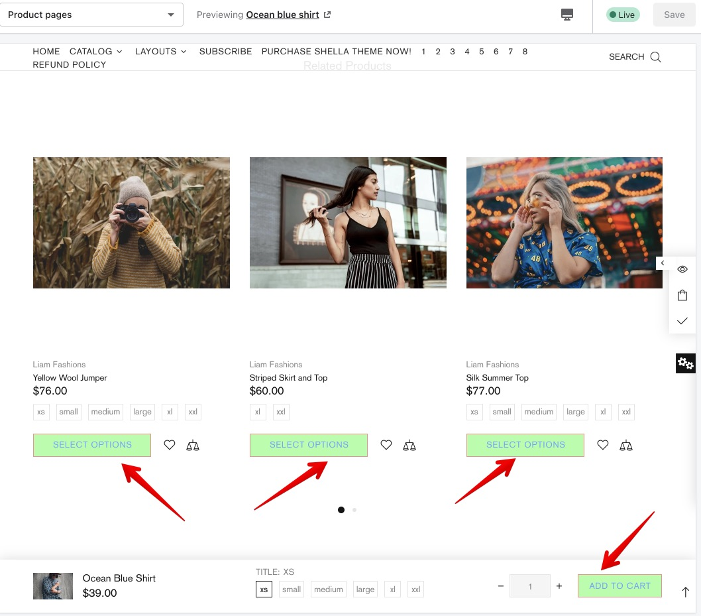

# Colors


**Theme settings -> Colors**


## Global

### Primary & Background for page body

#### Home page&#x20;

.png>)

#### Product page&#x20;

.png>)

#### Collection page&#x20;

.png>)

### Text & Heading

&#x20;Text (red) - for placeholder, drop-down inputs, info messages, etc

&#x20;Headings (green) - for block headings

#### Home page&#x20;

.png>)

#### Product page (Product description)

.png>)

#### Collection page&#x20;

.png>)

#### Blog post&#x20;

.png>)

### Link

.png>)

### Popup background

.png>)

## Buttons

&#x20;Here you may configure the colors for buttons.


**Please note**,  you should change the button type first. The theme includes 5 button types: **“Auto”, “Default”, “Invert”, “Secondary”, “Clean”**.


### Default button

&#x20;Here you may configure background, border and text colors. For default and hover (active) button states.&#x20;

&#x20;The button type depends of selected skin. Here are examples of default buttons:

### Secondary button

&#x20;You may configure the colors for second button type. For default button state (like on previous image) and hover button state.&#x20;

### Clean, invert buttons

&#x20;Clean and invert are another type of buttons, you may configure colors in the same way as for default & secondary buttons.

### Configure button type

&#x20;You may change the button type for:

* Add to cart button @ collection page
* Add to cart button @ product page
* Wishlisht button @ product page
* Compare button @ product page

## Paint Palette

&#x20;Here you can change the colors for the base, base background, text, additional background, borders, icons, diverse labels, such as success or “In stock”, error or “Sale”, “New”, “Hot”, and for the dynamic checkout button.

### Base

.png>)

### Base background

.png>)

### Text

.png>)

### Additional background

&#x20;This option applies for headers with two backgrounds:

.png>)

### Border

.png>)

### Icon

.png>)

### Success, In stock & Error, Sale, & Label 'New' & Label 'Hot'

.png>)

### Dynamic checkout btn

.png>)


**Please note**, in order to change the background color of the dynamic checkout button, you need to enable an option **“Custom style for dynamic checkout button”** in _Theme settings -> Product page & Quick view -> Product page only_. You can read more details [<mark style="color:blue;">**here**</mark>](https://mpithemes.gitbook.io/shella-shopify-theme/theme-settings/product-page-and-quick-view#custom-style-for-dynamic-checkout-button).


### Label 'Pre-order'

.png>)

### Input background

.png>)
