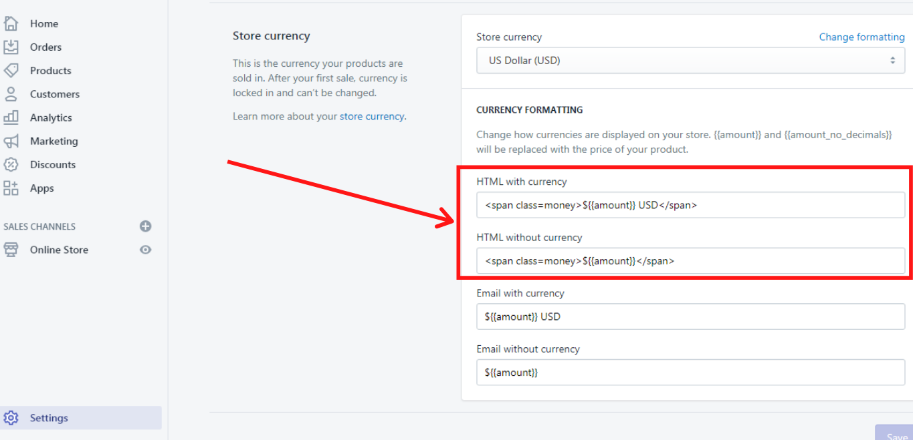

# Currency


**Theme settings -> Currency**


&#x20;By default the theme shows currencies configured at Shopify Payments. If you want to show currencies that are not supported by Shopify Payments - enable the info currency conversion below.

## Currency

### **Show sale price separator**

&#x20;This option enables you to show a sale price separator.

.png>)

&#x20;Please note, that the  text of this separator you can change by following these steps:

* Go to your _Shopify Admin -> Online store -> Actions_;
* Click on Edit languages;
* Click on “Products” tab (or simply write “Price sale separator” in Search);
* Start editing your content.

This is how it looks like:

.png>)

## Currency options

&#x20;You can choose two currency options for your store:

### 1. Client's currency

&#x20;**“Client´s currency”.** The customer is able to choose a currency from a currency dropdown menu in the header and pay with this currency at the checkout.

&#x20;**Example:** The customer is checking your store page in Germany and realizes, that all prices are shown in British Pounds and not in Euro. So, he or she clicks on the currency dropdown menu in the header and changes the currency from British Pounds to Euro. As a result, all prices are shown in Euro and at the checkout the client pays in the suitable for him or her currency, which is Euro in this example.

&#x20;Now if you want to add some extra currencies to your store, that should be shown in a currency dropdown menu, please follow these steps:

* Go to your **Shopify Admin** and click on **Settings**
* Then click on **Payments** and find **Add a third-party provider** and click on **Manage**
* In the section **Enabled currencies** you can decide which currencies will be supported by your store and shown in the currency dropdown menu. Just click on Add currency and choose the needed ones from the list.
* **Save changes.**

### 2. Store's currency


**WARNING!** If previously your store was using the first currency option (“Client´s currency”) and now you decided to change to the second currency option (“Store´s currency”) you need to **remove all your additional currencies** from the section **“Add third-party provider”** in your Shopify Admin and only after that, you can start with the second currency option (“Store´s currency”) which is described below!


&#x20;**“Store´s currency”.** The customer can choose a currency from a currency dropdown menu to see prices on the store page in the particular currency, but at the checkout the price will be shown in the store´s default currency and the client will also pay in the store´s default currency.

&#x20;**Example:** The customer is checking your store page in the USA and realizes, that all prices are shown in Euro and not in US dollars. So, he or she clicks on the currency dropdown menu in the header and changes the currency from Euro to US dollars. As a result, all prices are shown in US dollars but at the checkout, the client sees the prices in the store´s default currency and has to pay for his order in the store's default currency, which is Euro in this example.

&#x20;If you want to use the second currency option (“Store´s currency”), please follow these steps:

* In your **Shella Admin** go to _Theme Settings -> Currency_
* In the subsection **INFO CURRENCY** click on **Enable advanced currency conversion**
* Go to your **Shopify Admin** and click on _Settings -> General_
* In section **Store currency** choose the needed currency (e.g.: US Dollar (USD)) and click on **Change formatting**
* In the field **HTML with currency** write: ${{amount}} USD In the field **HTML without currency** write: ${{amount}}
* **Save changes.**

&#x20;**Example for USD:**

&#x20;Once you are done with the settings for the second currency option (“Store´s currency”) you can start formatting the currency.

#### **Format**

&#x20;Here are two formats available:

* With currency ($ 10.00 CAD)
* Without currency ($ 10.00)

&#x20;By the way, exactly for this option we have used the HTML code when enabling advanced currency conversion above.

.png>)

#### **Supported**

&#x20;Here you can write the supported currencies which will be shown on your store page e.g.: EUR, USD, GBP. Use the country's ISO **** [<mark style="color:blue;">**currency code**</mark>](https://www.xe.com/iso4217.php). Separate your currency codes with a space.

#### **Short names**

&#x20;Write the short names for the currencies, which will be shown as a chosen currency from the currency dropdown menu:

.png>)

#### **Full names**

&#x20;Write the full names for the currencies, which will be shown in the currency dropdown menu:

.png>)

#### **Default**

&#x20;Here you can set the default store´s currency, which will be shown in the checkout and in which you will get paid, e.g.: USD.\
