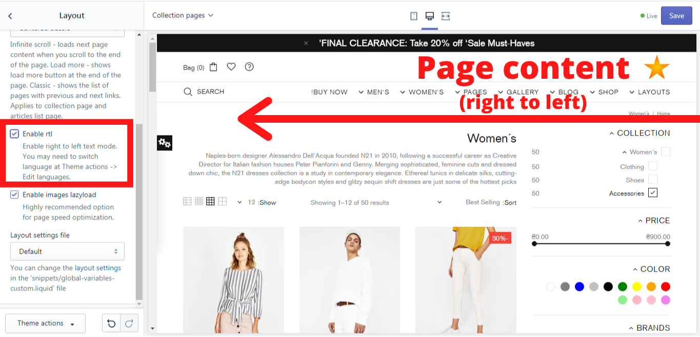

# Layout


&#x20;**Theme settings -> Layout**


### Default content width

&#x20;This option allows you to choose the content width. It can be either full or boxed. The default content width is **“Full width”**, but you can change it to **“Boxed”** anytime. The changes apply to the header, footer, and home page sections. You can overwrite this option at section options.&#x20;



.png>)



.png>)



### Show breadcrumbs

&#x20;If you enable this option, the whole path you did to get to the particular product will be shown:

.png>)

### Pagination type

&#x20;A Shella theme offers you 4 pagination types. **“Infinite scroll”** - loads next page content when you scroll to the end of the page. **Button “Load more”** - shows a “Load more” button at the end of the page. **“Classic”** - shows the list of pages with previous and next links. **“Centered classic”** - shows the list of pages with previous and next links, and is centered at the end of the page. Applies to the collection page and articles list page.



.png>)



.png>)



.png>)



### Enable RTL

&#x20;If you enable this option, the whole page content will be shown from the right side to the left. You may need to switch language at your _Shopify Admin -> Online store -> Actions -> Edit languages._

&#x20;Example: If you need to have the page in Arabic, you need to follow these steps:

1. Change the theme language to Arabic (please make sure, that the texts on your page are translated in Arabic).
2. Enable RTL.&#x20;

### Enable images lazyload

&#x20;This option enables a page speed optimization. You can check what lazy loading means and how it works in the example of Shopify’s lazy loading method in [<mark style="color:blue;">**How Lazy Loading can Optimize Your Shopify Theme Images**</mark>](https://www.shopify.com/partners/blog/lazy-loading).&#x20;


**Please note**, that the Shella theme uses a completely different code for this purpose!


### Skin

&#x20;Select the preset color, typography and padding configuration. You may review the skin storefront at our demo stores.


****[<mark style="color:blue;">**VIEW DEMO**</mark>](https://mpthemes.net/shella-shopify-theme/intro-center-cdn/)<mark style="color:blue;">****</mark>


### Age confirmation

&#x20;Here you can configure the **“Age confirmation”** popup. Enable an option **“Enable age confirmation popup”** if you want to use it for your store. Select the **“Background image”** to make it more attractive for the clients. Use the **“Background image width”** scale from 100 to 1200 to change the image size. You can also decide if to show or hide the confirmation checkbox.&#x20;

.png>)


****[<mark style="color:blue;">**VIEW ​DEMO**</mark>](https://shella-cannabis-cbd.myshopify.com)<mark style="color:blue;">****</mark>

