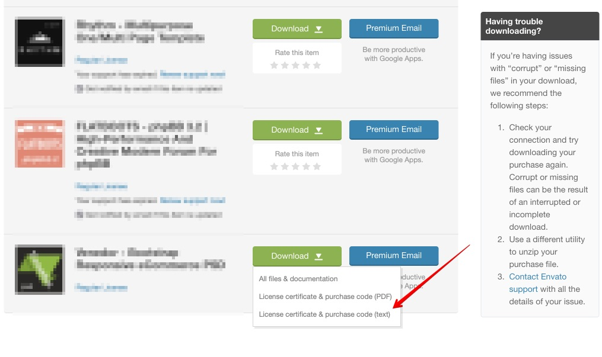
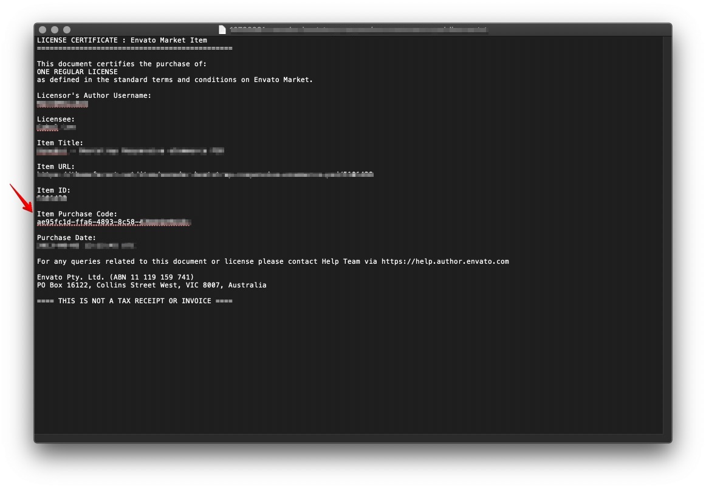

# License


**Theme settings -> License**



**IMPORTANT!** A regular theme license allows you to use the theme at one store. If you want to use the theme for more stores, you should purchase a new license.


## HOW TO GET THE PURCHASE CODE? 

&#x20;Please follow these steps to get the purchase code:

1\. Download a .txt file with theme purchase code from your themeforest.net account:&#x20;

2\. Find your purchase code. Open the text file and copy your purchase code:&#x20;

3\. Paste it to theme settings at _Online store -> Themes -> Customize -> Theme settings -> License -> Purchase code_:&#x20;

.png>)

4\. Save theme settings.

### Envato Market Help Page

&#x20;If you can't find a purchase code at your ThemeForest account, please check **** [<mark style="color:blue;">**Where Is My Purchase Code**</mark>?](https://help.market.envato.com/hc/en-us/articles/202822600-Where-Is-My-Purchase-Code-) help page for more details.

### Enable a gear wheel popup (Presentation mode)

&#x20;Untick this option in a real store. This option is only for the demo store.&#x20;

.png>)
