# Logo & Favicon


**Theme settings -> Logo & Favicon**


&#x20;Here you can select a logo type for your store. There are 2 logo types: Image and SVG. Please select 'Image' if you want to use and download images for your logo. If you use 'SVG', replace the code in the logo file with yours.

## Main Logo 

### For logo type “Image”:

#### Logo file name

&#x20;For the logo type “Image” this option is irrelevant. You can leave this field empty if you are going to upload an image and not an SVG for your main logo.

#### Logo image

&#x20;Here you can select or upload an image for your logo, which can be changed, edited, and removed any time.

&#x20;**The recommended size for the image is 64x27 pixels.**

#### Logo width

&#x20;Here you can decide, what width your logo should have.

&#x20;**The width can vary from 50px to 250 px.**&#x20;

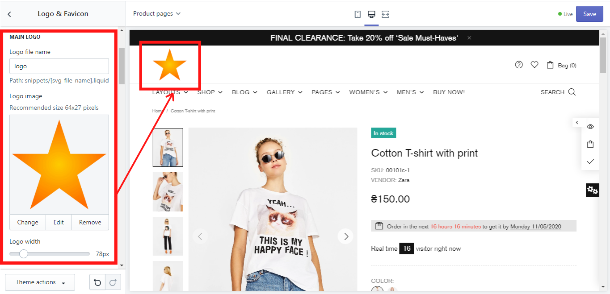

### For logo type “SVG”: 


**Please note,** that due to its complexity, an SVG logo type should be chosen by the customers with advanced computer skills or by developers only!


#### Logo file name

&#x20;Here you should write an SVG logo file name, but before you do that, you need to add a snippet. This can be done in a few steps:

1\. If you already have an SVG code, go to _Theme actions -> Edit code_ (If you do not know where to get the SVG code, check our “Tips for logo type “SVG”):

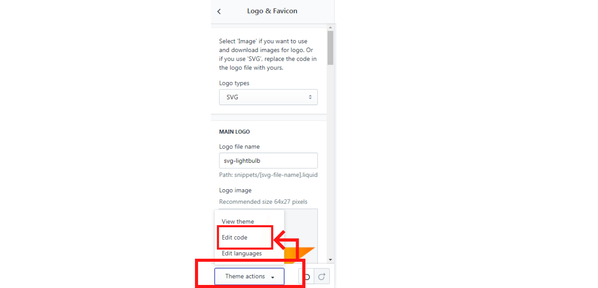

2\. Click on “Snippets”:&#x20;

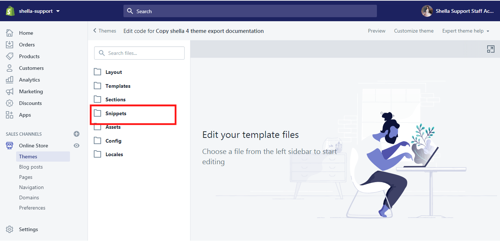

3\. Click on “Add a new snippet” and type a snippet name and click on “Create snippet”. In this example, we will use the snippet name: svg-lightbulb:&#x20;

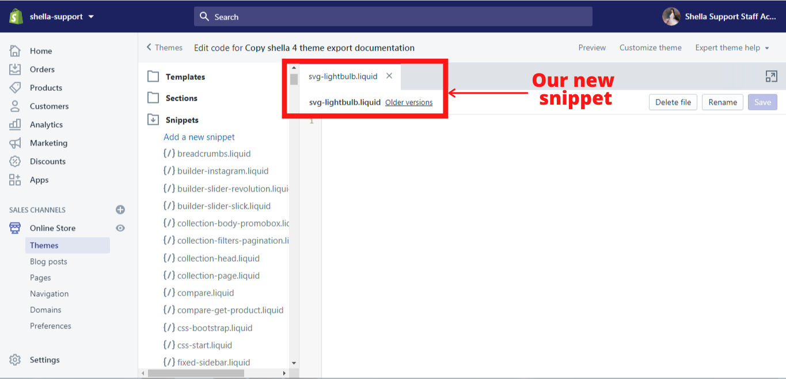

4\. Add a snippet code and click on “Save”:&#x20;

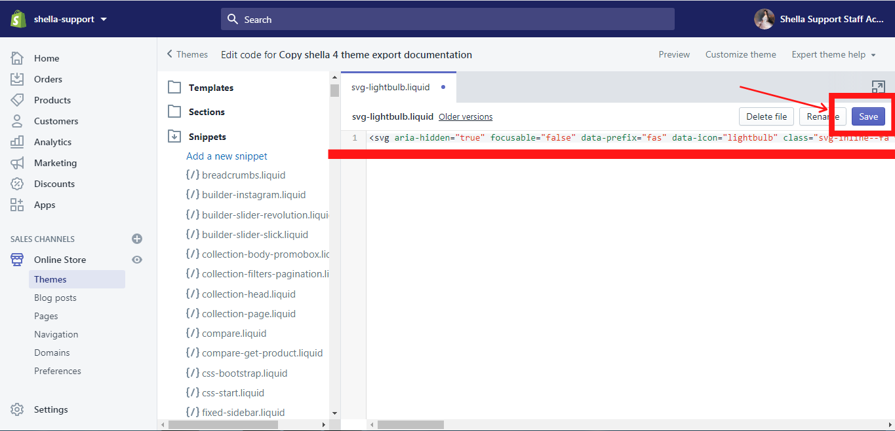

5\. Now type the name of the SVG snippet (in our case it is svg-lightbulb) in the logo file name and click on “Save”:&#x20;

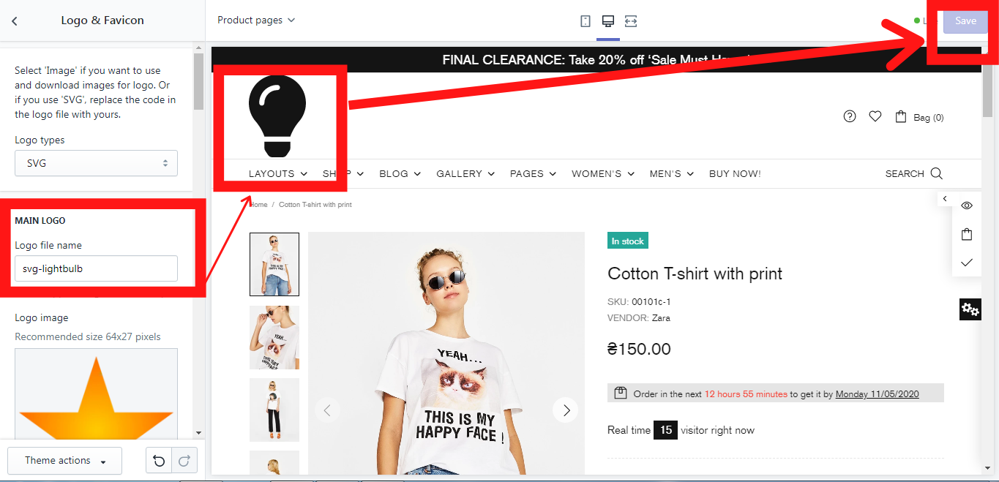

#### Logo image

&#x20;For the logo type “SVG” this option is irrelevant.

#### Logo width

&#x20;Here you can decide, what width your logo should have.

&#x20;**The width can vary from 50px to 250 px.**

## Mobile Header Logo

### For logo type “Image”:

#### **Mobile logo file name**

&#x20;For the logo type “Image” this option is irrelevant. You can leave this field empty if you are going to upload an image and not an SVG for your mobile logo.

#### **Mobile logo image**

&#x20;Here you can select or upload an image for your mobile logo, which can be changed, edited, and removed any time. This image can be different from the main logo image. It is up to you to decide which one you prefer.

&#x20;**The recommended size 34x27 pixels.**

#### **Mobile logo width**

&#x20;Here you can decide, what width your mobile logo should have.

&#x20;**The width can vary from 20px to 220 px.**

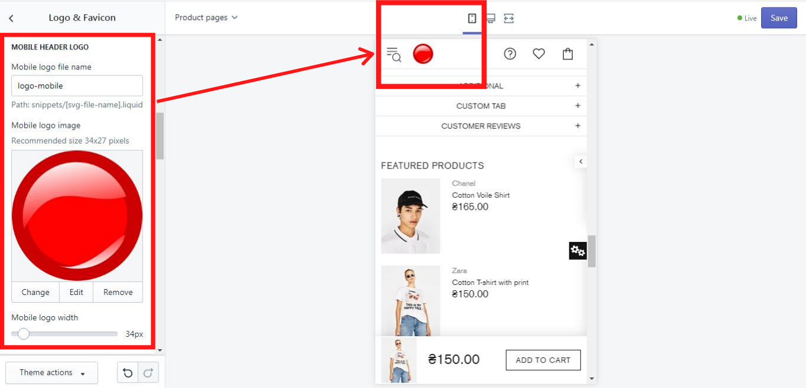

### For logo type “SVG”:


**Please note,** that due to its complexity, an SVG logo type should be chosen by the customers with advanced computer skills or by developers only!


#### Mobile logo file name

&#x20;Here you should write an SVG logo file name, but before you do that, you need to add a snippet. This can be done in a few steps:

1\. If you already have an SVG code, go to _Theme actions -> Edit code_ (If you do not know where to get the SVG code, check our “Tips for logo type “SVG”):&#x20;

2\. Click on “Snippets”:&#x20;

3\. Click on “Add a new snippet” and type a snippet name and click on “Create snippet”. In this example, we will use the snippet name: svg-lightbulb:

4\. Add a snippet code and click on “Save”:&#x20;

5\. Now type the name of the SVG snippet (in our case it is svg-lightbulb) in the logo file name and click on “Save”:&#x20;

#### **Mobile logo image**

&#x20;For the logo type “SVG” this option is irrelevant.

#### **Mobile logo width**

&#x20;Here you can decide, what width your logo should have.&#x20;

&#x20;**The width can vary from 20px to 220 px.**

## Sticky Header Logo

&#x20;If you want to show the logo on the sticky header. Configure it here.

&#x20;Sticky Header Logo has the same options as other logo options at current theme settings.


**Please note**, the Logo on the sticky header will be displayed for the sticky type **“Wide (Full header)”** selected in the _Header -> Sticky header -> Sticky type (Desktop)_, no matter if you applied settings in “Sticky Header Logo” block, or not.&#x20;

For the **Header type #3** and **Header type #4** (slim menu line), the Logo on the sticky header will be displayed even if you select the **“Slim (Menu line)”** and do not apply settings in the present block.


&#x20;More information about how to customize the “Sticky Header” you can find [<mark style="color:blue;">**here**</mark>](https://mpithemes.gitbook.io/shella-shopify-theme/header#sticky-header).

## Footer Logo

### For logo type “Image”:

#### **Footer logo file name**

&#x20;For the logo type “Image” this option is irrelevant. You can leave this field empty if you are going to upload an image and not an SVG for your footer logo.

#### **Footer logo image**

&#x20;Here you can select or upload an image for your footer logo, which can be changed, edited, and removed any time. This image can be different from the main logo image. It is up to you to decide which one you prefer.

&#x20;**The recommended size is 64x27 pixels.**

#### **Footer logo width**

&#x20;Here you can decide, what width your footer logo should have.

&#x20;**The width can vary from 50px to 250 px.**

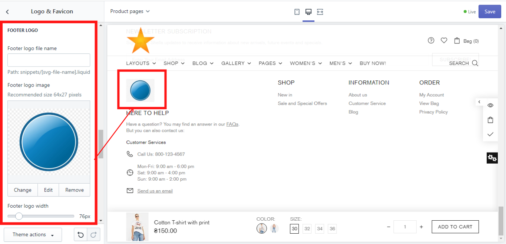

### For logo type “SVG”:


**Please note,** that due to its complexity, an SVG logo type should be chosen by the customers with advanced computer skills or by developers only!


#### &#x20;Footer logo file name

Here you should write an SVG logo file name, but before you do that, you need to add a snippet. This can be done in a few steps:

1\. If you already have an SVG code, go to _Theme actions -> Edit code_ (If you do not know where to get the SVG code, check our “Tips for logo type “SVG”):

2\. Click on “Snippets”:&#x20;

3\. Click on “Add a new snippet” and type a snippet name and click on “Create snippet”. In this example, we will use the snippet name: svg-lightbulb:&#x20;

4\. Add a snippet code and click on “Save”:&#x20;

5\. Now type the name of the SVG snippet (in our case it is svg-lightbulb) in the logo file name and click on “Save”:&#x20;

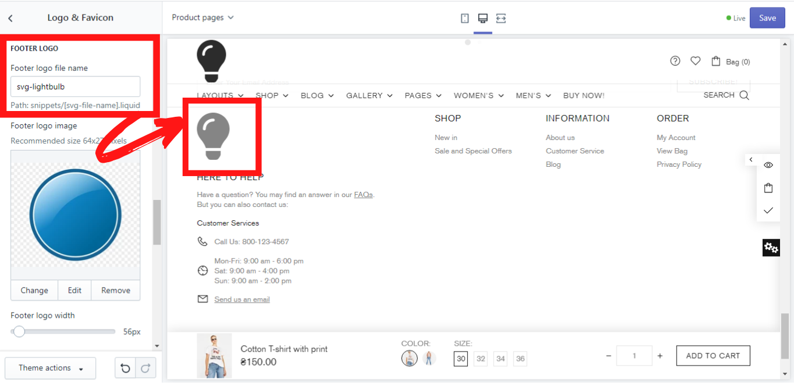

#### **Footer logo image**

&#x20;For the logo type “SVG” this option is irrelevant.

#### **Footer logo width**

&#x20;Here you can decide, what width your logo should have.

&#x20;**The width can vary from 50px to 250 px.**

## Mobile Footer Logo

### For logo type “Image”:

#### **Mobile footer logo file name**

&#x20;For the logo type “Image” this option is irrelevant. You can leave this field empty if you are going to upload an image and not an SVG for your mobile footer logo.

#### **Mobile footer logo image**

&#x20;Here you can select or upload an image for your mobile footer logo, which can be changed, edited, and removed any time. This image can be different from the main logo image. It is up to you to decide which one you prefer.

&#x20;**The recommended size is 64x27 pixels.**

#### **Mobile footer logo width**

&#x20;Here you can decide, what width your footer logo should have.

&#x20;**The width can vary from 20px to 220 px.**

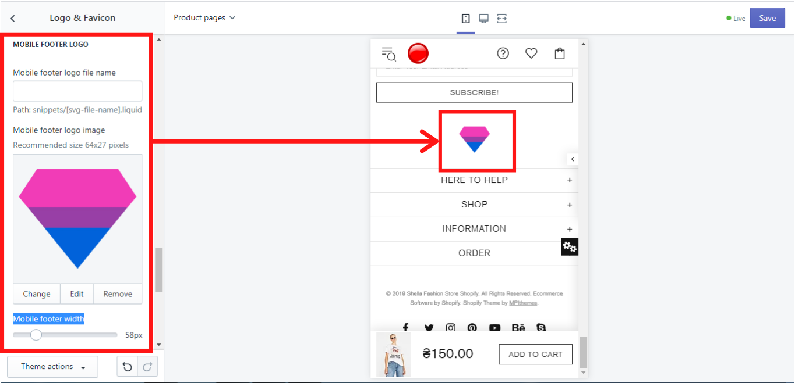

### For logo type “SVG”:&#x20;


**Please note,** that due to its complexity, an SVG logo type should be chosen by the customers with advanced computer skills or by developers only!


#### &#x20;Mobile footer logo file name

Here you should write an SVG logo file name, but before you do that, you need to add a snippet. This can be done in a few steps:

1\. If you already have an SVG code, go to _Theme actions -> Edit code_ (If you do not know where to get the SVG code, check our “Tips for logo type “SVG”):

2\. Click on “Snippets”:&#x20;

3\. Click on “Add a new snippet” and type a snippet name and click on “Create snippet”. In this example, we will use the snippet name: svg-lightbulb:

4\. Add a snippet code and click on “Save”:&#x20;

5\. Now type the name of the SVG snippet (in our case it is svg-lightbulb) in the logo file name and click on “Save”:&#x20;

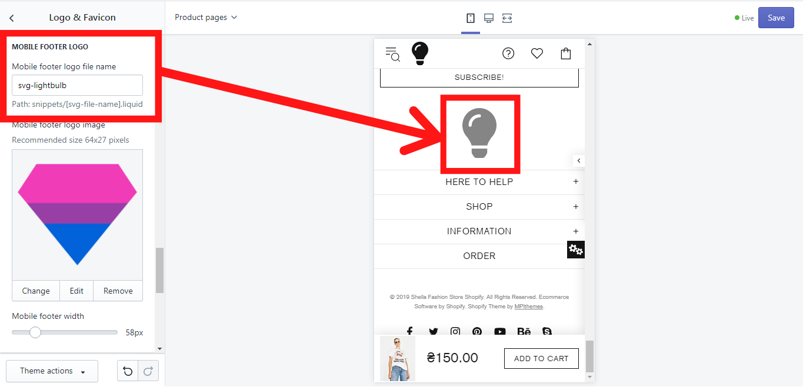

#### **Mobile footer logo image**

&#x20;For the logo type “SVG” this option is irrelevant.

#### **Mobile footer logo width**

&#x20;Here you can decide, what width your logo should have.

&#x20;**The width can vary from 20px to 220 px.**

## Tips for logo type “SVG”

&#x20;If you do not know what is an SVG code, follow these steps:

1\. Find an SVG file for your logo on your computer. It might look like this:

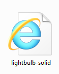

2\. Hover over the file, click the right mouse button and open it with Notepad ++ (we recommend you to use Notepad ++). You see the SVG code in the window of Notepad ++, which you can copy and paste in the snippet:

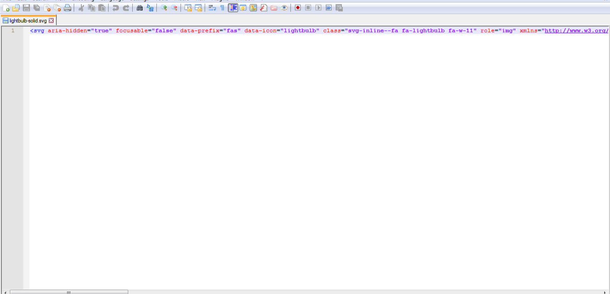

## Favicon

&#x20;Here you can select or upload an image for your favicon, which can be changed, edited, and removed any time.

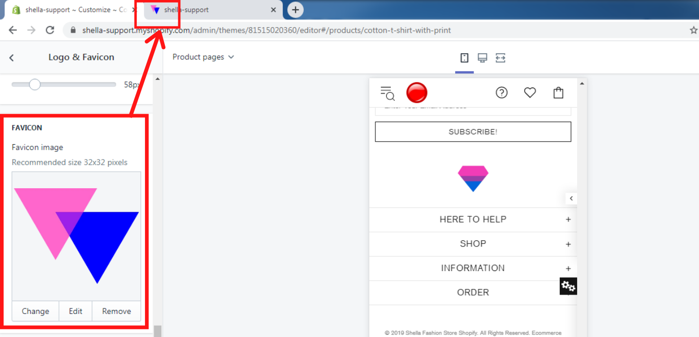

**The recommended size is 32x32 pixels.**

