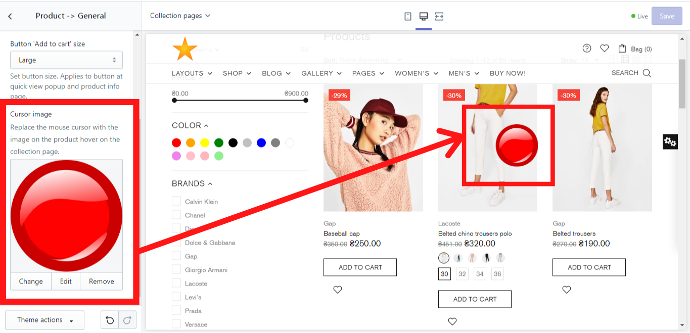

# Product -> General


**Theme settings -> Product -> General**


## Storewide product options

### **Enable format 'PJPG'**

&#x20;If you enable this option, it will lead to a better page speed performance. Don't work with transparent image formats such as GIF, PNG.

### Cursor image

&#x20;This option allows you to replace the mouse cursor with any image you like on the product hover on the collection page:

