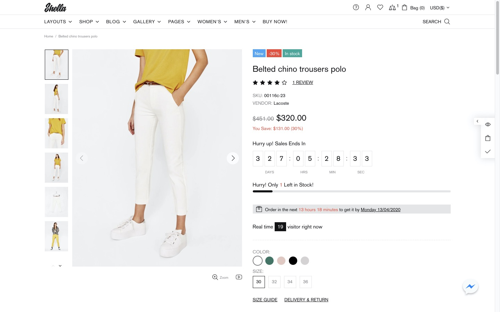
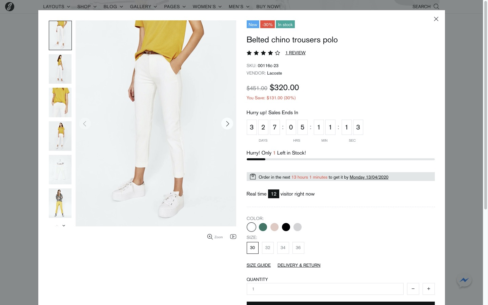
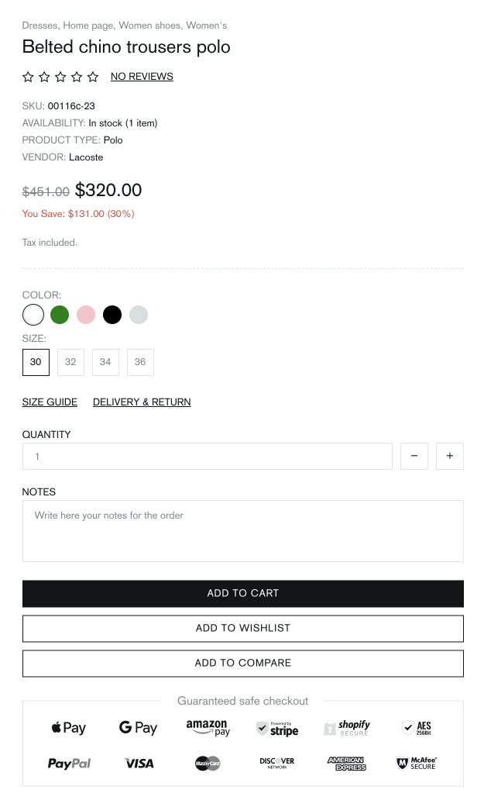
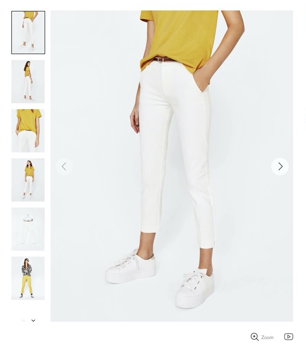
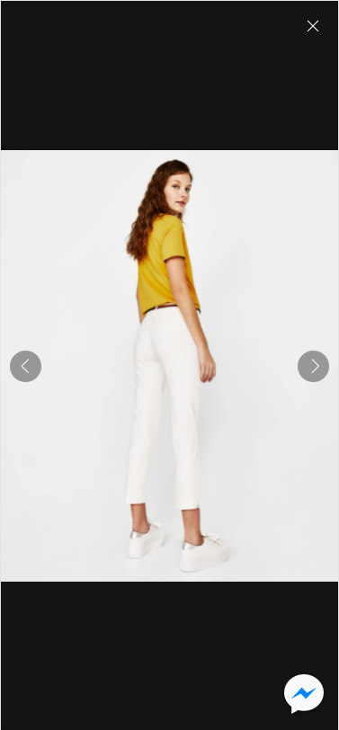
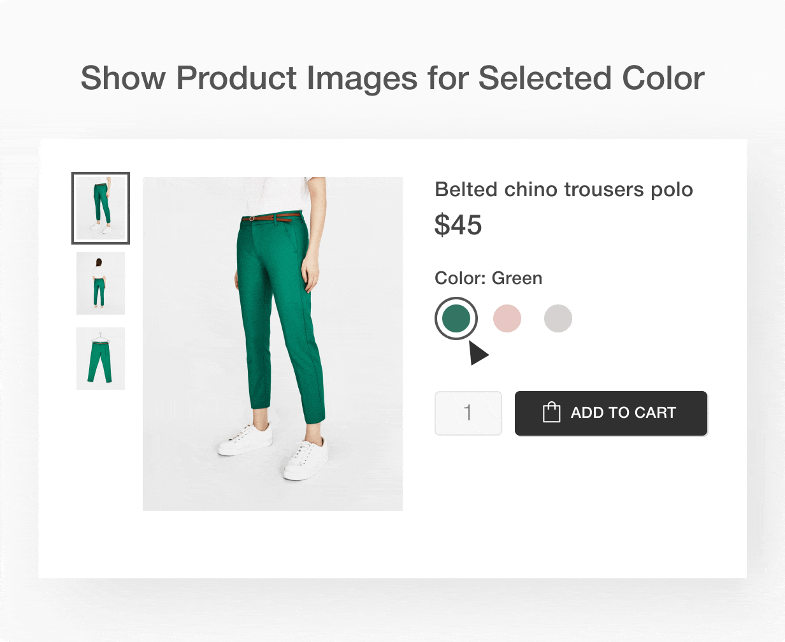
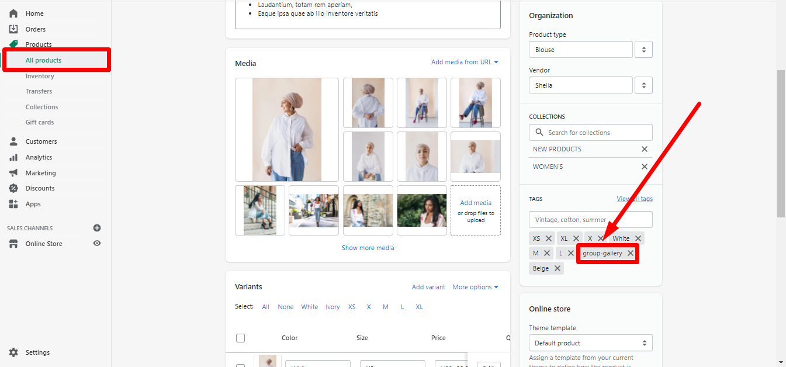
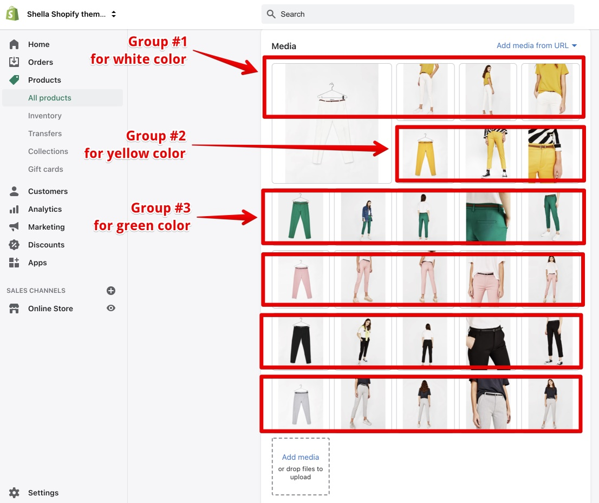
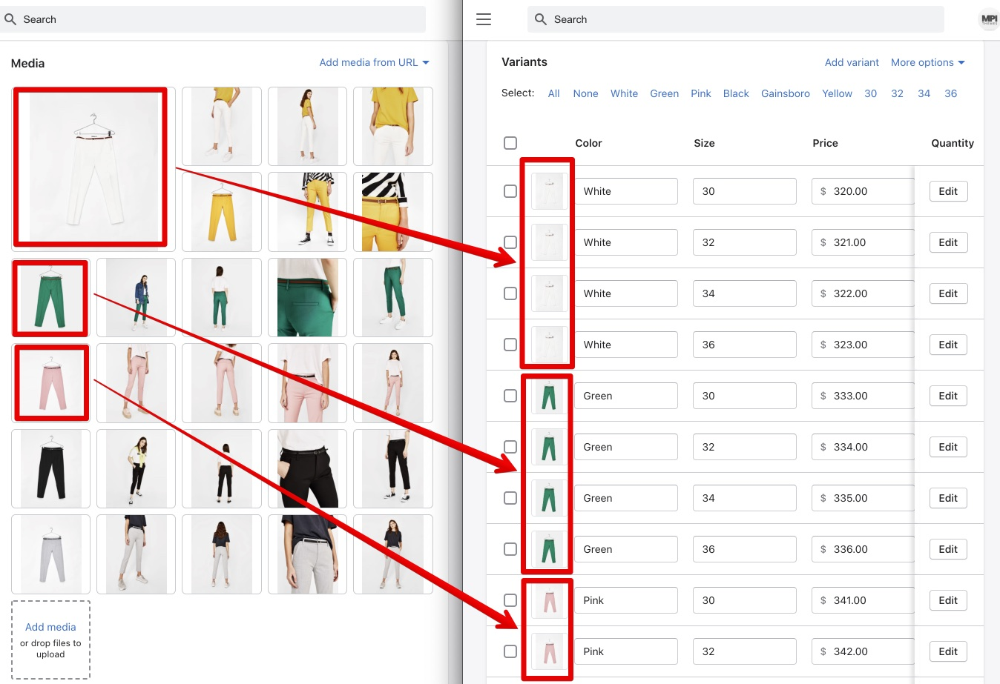
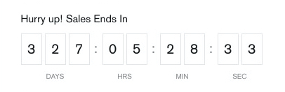

# Product Page & Quick View


**Theme settings -> Product Page & Quick View**


#### Video manual list

* [<mark style="color:blue;">Product page: Content. Part 1</mark>](https://www.youtube.com/watch?v=W6LEdECdrIA\&list=PLj-506KaR\_vcQjwcpC6yII-1JY0bSj7df\&index=17)<mark style="color:blue;"></mark>
* [<mark style="color:blue;">Product page: Content. Part 2</mark>](https://www.youtube.com/watch?v=0AlSYWp5vh8\&list=PLj-506KaR\_vcQjwcpC6yII-1JY0bSj7df\&index=18)<mark style="color:blue;"></mark>

Here you can configure the elements for the product info page & the quick view popup.











&#x20;You may show or hide any element:



## Layout

&#x20;Here you can choose a layout that suits best for your product info page and a quick view popup. The theme includes five layouts:







.png>)



.png>)



.png>)



.png>)




**Please note**, the layout option applies to all products at your store.


&#x20;You may have different product page layouts per product. Add **gallery-layout-1** tag to the product in _Shopify admin -> Products_, where **1** is the number of layout from 1 to 5.

&#x20;Example: Add the **gallery-layout-3** tag to product to enable Layout #3 for this product:

.png>)

## Gallery

&#x20;Here you can configure the product’s gallery.


**Please note**, the recommended size for the product’s image is 1300 x 1667 pixels.




### **Show thumbnails on mobile**

&#x20; If you enable this option, the gallery images will be shown on mobile view:

.png>)

### **Enable Fullscreen gallery popup**

&#x20;If you enable this option, the product images popup will be shown by clicking on an image, both on desktop and mobile view. This is how it may look like on mobile:



### **Show button 'Fullscreen gallery'**

&#x20;If you enable this option, the zoom button under the main image will be shown. The button activates a full-screen popup.


**Please note**, the button will be activated only with the enabled option “Enable fullscreen gallery popup”.


### **Show button 'Video'**

&#x20;If you enable this option, the “Video” button under the main image will be shown.

&#x20;This button navigates to the first product video. The visitor may navigate to the video media using arrows or thumbnails.

### **Enable autoplay video**

&#x20;If you enable this option, the product video will be played automatically. Disable this option, if you need to play video on click.

### **Enable zoom with mouse**

&#x20;This option enables zoom inside the main image container. The zoom will be activated by the mouse hover on the main image.

.png>)

### **Zoom scale coefficient**

&#x20;This option enables you to determine zoom ratio inside the main image container. Use the scale to change the parameters from 1.1 to 5.

### Set image height and size from

&#x20;Set image height and size from **“Extend Collection Page settings”** if you want to leave parameters applied in _Theme settings -> Product -> Collection Page -> Image_. Or choose **“Set this section settings”** to customize images on product pages regardless of the collection page settings.

### **Gallery images height**


**Please note**, the product images should have the same proportion as the image container. If they have a different proportion, you will see a white space on the left/right or top/bottom.


&#x20;Here you can set the proportion for the image container.&#x20;

The default value is - 128

100 to show square image container

50 to show the 'landscape' proportion

150 to show the 'portrait' proportion


**Please note**, this option doesn't work for 'Image resize = Auto' which comes next.


### **Image resize**

&#x20;Here you have 5 image resize options:

* **Auto** - if you choose this option, ignore the previous option of the image height (in % of the width). The image container and the image size are generated based on source image dimensions.
* **Contain** - CSS object-fit = contain. If you choose this option, the image will look like: object-fit demo.
* **Cover** - CSS object-fit = cover. If you choose this option, the image will look like: object-fit demo.
* **Stretch by width** - in this option, the image width fits the container width. It is centered vertically. If the image height is more than the container, cut the image from the top and the bottom. If the image height is less than the container, add white space at the top and the bottom of the image.
* **Stretch by height** - in this option, the image height fits the container height. The image is centered horizontally.

### **Image resize on mobile**

&#x20;Here you can decide if to resize product images automatically, by choosing an option **"Auto"**.

&#x20;Enable an option **"Use settings like on desktop"**, if you want to apply this section settings for mobile view.

### **Group gallery by options**




[<mark style="color:blue;">**VIEW DEMO**</mark>](https://shella-demo8.myshopify.com/products/belted-chino-trousers)<mark style="color:blue;">****</mark>


**Disable** - don't group images

**Enable** - group product images for all products at your store

**Activate with tag 'group-gallery'** - group product images only for tagged products. Add the **group-gallery** tag to products for which you need to group product images:



Group product feature requires the product media configuration:

* group product images at _Shopify Admin -> Product:_



* configure first image of the group to product variants&#x20;



&#x20;Check the following [<mark style="color:blue;">**video tutorial**</mark>](https://youtu.be/6sQ2ZMwGrJg) for the example, how to group product images.

### **Enable sticky gallery**

&#x20;If you enable this option, the image of the product remains sticky, which means it will be shown while scrolling down the product page until the button “BUY IT NOW”:


&#x20;If you disable this option, there will be a blank white space, instead of the product´s gallery:


## Labels

.png>)

&#x20;Here you can configure the product labels. You may disable labels for all store products.

&#x20;Two conditions are required to show the product label:

1. Enable labels at theme settings.
2. Configure the product.

### **Show label 'In stock'**

&#x20;If you enable this option, the “In stock” label will be shown for products with enabled inventory tracking and quantity bigger than zero.

### **Show label 'Pre order'**

&#x20;If you enable this option, the "Pre order" label will be shown for products with enabled inventory tracking and zero quantity. How to configure the 'Pre order' feature  you can read [<mark style="color:blue;">**here**</mark>](https://mpithemes.gitbook.io/shella-shopify-theme/product-page-1/pre-order).

### **Show label 'Out of stock'**

&#x20;If you enable this option, the “Out of stock” label will be shown for products with enabled inventory tracking and zero quantity.

### **Show label 'Sale'**

&#x20; If you enable this option, the “Sale” label will be shown for products with configured "compare at" price in _Shopify Admin -> Products_.

.png>)


**Please note**, you can configure “New” and “Hot” labels via Metafields.

Check this [<mark style="color:blue;">**help page**</mark>](https://mpithemes.gitbook.io/shella-shopify-theme/product-metafields#labels) <mark style="color:blue;">****</mark> for more details about the product meta fields.


### **Show label 'New'**

&#x20;If you enable this option, the “New” label will be shown for products with metafield **labels.new = true**

### **Show label ''Hot''**

&#x20;If you enable this option, the “Hot” label will be shown for products with metafield **labels.hot = true**

## Base information

### **Show** collections

&#x20;If you enable this option, the product's collections will be shown.

### Show title

&#x20;If you enable this option, the product’s title will be shown.

## Reviews

### **Show reviews**

&#x20;If you enable this option, the product reviews will be shown in the product information section, below the Title.&#x20;


**Please note**, the product reviews app needs to be installed! You can choose one of the proposed reviews apps in **** _Theme settings -> Reviews._ Check this [<mark style="color:blue;">**help page**</mark>](https://mpithemes.gitbook.io/shella-shopify-theme/theme-settings/untitled-15) <mark style="color:blue;">****</mark> for more details.

We use a free <mark style="color:blue;"></mark> [<mark style="color:blue;">**Product Reviews**</mark>](https://apps.shopify.com/product-reviews) app on our demo.


&#x20;The “Reviews” tab for product page can be enabled in _Products -> Product page -> Tabs._ More information you can find [<mark style="color:blue;">**here**</mark>](https://mpithemes.gitbook.io/shella-shopify-theme/products/product-page#tabs).

### **Hide reviews counter**

&#x20;If you enable this option, only review stars will be shown. The number of reviews will be hidden.

### **Hide no reviews**

&#x20;This option allows you to hide the 'no reviews' text if a product has zero reviews.

## Product details

### Show product SKU

&#x20;If you enable this option, the product’s SKU will be shown.

### **Show product barcode**

&#x20;If you enable this option, the product’s barcode will be shown.

### Show product stock status

&#x20;If you enable this option, the product’s stock status will be shown.

### **Show product type**

&#x20; If you enable this option, the product’s type will be shown.

### **Show product vendor**

&#x20;If you enable this option, the product’s vendor will be shown.

## Price

### Show price

&#x20;If you enable this option, the product’s price will be shown.

### **Show sale price details**

&#x20;If you enable this option, the “compare at”  price will be shown.

### **Show taxes text**

&#x20;If you enable this option, the tax text will be shown.

### Show payment terms

&#x20;This option is ticked by default. But will be active with the configured payment\_terms. Learn more [<mark style="color:blue;">**here**</mark>](https://shopify.dev/themes/pricing-payments/installments). Deactivate the option if it is not necessary to display the "Shop pay instalments" banner on your store.

## Description

### Show description

&#x20;Here you can decide the location of a product description. If you enable the option, a product description will be shown in the product information section. This is a good choice for short description to show it just after the product price and before the add to cart button:



**Please note**, if you want to show a product description only in the product information section, disable the option **“Show tab for Description”** in _Products -> Product page -> Tabs_. More about this functionality you can read [<mark style="color:blue;">**here**</mark>](https://mpithemes.gitbook.io/shella-shopify-theme/products/product-page#tabs).


## Selling plan

### Show selling plan select

&#x20; In order to allow customers to subscribe to favorite products for purchasing, enable the option.&#x20;


**Please note**, the Subscription app needs to be installed!


## Time countdown

### **Show countdown**

&#x20;This option enables you to show the sale countdown timer:




**Please note**, you can configure “Sale countdown” via Metafields.

Check this [<mark style="color:blue;">**help page**</mark>](https://mpithemes.gitbook.io/shella-shopify-theme/product-metafields#countdown) <mark style="color:blue;">****</mark> for more details about the product meta fields.


Three conditions are required for this block:

1. Enable this option
2. Set 'compare at' price for the product
3. Add metafield with the sale end date. **countdown.date = '2020-10-29 17:10:09'**

## Stock Countdown

### **Show stock countdown**

&#x20;If you enable this option, the product’s stock countdown will be shown like this:

.png>)

### **Show range of stock countdown**

&#x20;If you enable this option, a range of the stock countdown for the product will be shown like this:

.png>)

### **Stock countdown min value**

&#x20;This option enables you to set the boundary value for 'Hurry! Only XX Left in Stock!'

## Delivery countdown

### **Show delivery countdown**

&#x20;If you enable this option, the delivery text countdown will be shown like this:

.png>)

**Configure options for 'Order in the next XX hours to get it by YY date' block:**

*   **Hours of the day to reset delivery countdown**

    This option enables you to set hours of the day, till which the order should be done, to reset the delivery countdown.

    _Example:_

    If the current time is 10:45 AM and you set 15 hours, then the system will show “Order in the next 4 hours15 minutes to get it by…”
*   **Average delivery time of delivery countdown (days)**

    This option enables you to set the average number of days, at which the delivery will be done.

    _Example:_

    If today’s date is Thursday 30/04/2020, and you set 3 days, then the system will show “Order in the next XX hours XX minutes to get it by Sunday 03/05/2020 “.
*   **Format of delivery countdown date**

    Here you can set the format of the delivery countdown date manually. A lot of options are available. Some of them are listed below.

    _Example:_

    If you set **Day DD/MM/YYYY**, the system will show **Monday 04/05/2020**.

    If you set **Day MM/YYYY**, the system will show **Monday 05/2020**.

    If you set **Day YYYY**, the system will show **Monday 2020**.

    If you set **Day**, the system will show **Monday**.

    If you set **DD/MM/YYYY**, the system will show **04/05/2020**.

    If you set **Day DD/MM/YY**, the system will show **Monday 04/05/20**.

    If you set **DD/MM/YYYY Day**, the system will show **04/05/2020 Monday**.
*   **Exclude days of the week**

    Here you can type manually which days should be excluded from the delivery countdown date.

**EXAMPLE:**

&#x20;If today’s date is Thursday 30/04/2020, you set 3 days for a delivery countdown date, and then in the field “Exclude days of the week” you typed **Saturday, Sunday** then the system will show “Order in the next XX hours XX minutes to get it by Monday 04/05/2020 “.

## Visitors

### **Show visitors**

&#x20;If you enable this option, the real-time visitors will be shown like this:

.png>)

#### **Configure options for 'Real-time XX visitor right now'**

#### **Min value**

&#x20;Here you can set the minimum value of visitors, which can be shown in “Real-time XX visitor(s) right now”. You can choose the value from 1 to 50.

#### **Max value**

&#x20;Here you can set the maximum value of visitors, which can be shown in “Real-time XX visitor(s) right now”. You can choose the value from 1 to 50.

#### **Max value stroke**

&#x20;Here you can set the maximum value stroke of visitors, shown in “Real-time XX visitor(s) right now”. You can choose the value from 1 to 20.

#### **Min update interval**

&#x20;Here you can choose the minimum update interval in seconds, which changes the value of visitors at a particular time in seconds.

#### **Max update interval**

&#x20;Here you can choose the maximum update interval in seconds, which changes the value of visitors at a particular time in seconds.

**EXAMPLE** for **Configure options for 'Real-time XX visitor right now'**:

**Visitors min value**:\
20\
**Visitors max value**:\
40\
**Visitors max value stroke**:\
10\
**Visitors min update interval**:\
3\
**Visitors max update interval**:\
6\
&#x20;Here the span of visitors in real-time is from 20 to 40, the value stroke is set for 10 and the visitors update interval in seconds has a span from 3 to 6 seconds. These settings mean, that every 3-6 seconds the visitor’s minimum value will increase from 1 to 10 visitors, and the maximum will remain 40.


**IMPORTANT!** In order to avoid a span in the visitor’s update interval, the same value needs to be set **both** for visitors minimum and maximum update interval, e.g.: if you set 5 seconds both for visitors minimum and maximum update interval, the updates will be shown strictly every 5 seconds only.


## Options

### Show top border

&#x20;If you enable the option the border will be shown in the product information section:


### **Show options (variants)**

&#x20;This option allows you to show the product’s variants.

## Popups

### **Show button 'Size guide'**

&#x20;If you enable this option, a “Size guide” popup will be shown.&#x20;

**Content for 'Size guide'**

&#x20;Here you can set content for the size guide popup. Add and edit page at **** _Online store -> Pages._ If no page is selected for the content for “Size guide”, a page “Include Popup Size Guide” will be selected by default.

&#x20;An HTML example of it you can find here:

```
<div class="container container--sm px-0">
    <p class="mb-50 text-center">This is an approximate conversion table to help you find your size. If you have already purchased an item by our brand, we recommend you select the same size as indicated on its label.</p>
</div>
<div class="row mt-60">
    <div class="col-12 col-md-9">
        <h4 class="mb-15 text-center">Women’s apparel sizing</h4>
        <div class="table-wrap">
            <table class="table-size-guide responsive-table table-center mb-35">
                <tbody>
                    <tr>
                        <th>INTERNATIONAL</th>
                        <th>XS</th>
                        <th>S</th>
                        <th>M</th>
                        <th>L</th>
                        <th>XL</th>
                        <th>XXL</th>
                        <th>XXXL</th>
                    </tr>
                    <tr>
                        <td>EUROPE</td>
                        <td>32</td>
                        <td>34</td>
                        <td>36</td>
                        <td>38</td>
                        <td>40</td>
                        <td>42</td>
                        <td>44</td>
                    </tr>
                    <tr>
                        <td>US</td>
                        <td>0</td>
                        <td>2</td>
                        <td>4</td>
                        <td>6</td>
                        <td>8</td>
                        <td>10</td>
                        <td>12</td>
                    </tr>
                    <tr>
                        <td>CHEST FIT (INCHES)</td>
                        <td>28"</td>
                        <td>30"</td>
                        <td>32"</td>
                        <td>34"</td>
                        <td>36"</td>
                        <td>38"</td>
                        <td>40"</td>
                    </tr>
                    <tr>
                        <td>CHEST FIT (CM)</td>
                        <td>716</td>
                        <td>76</td>
                        <td>81</td>
                        <td>86</td>
                        <td>91.5</td>
                        <td>96.5</td>
                        <td>101.1</td>
                    </tr>
                    <tr>
                        <td>WAIST FIR (INCHES)</td>
                        <td>21"</td>
                        <td>23"</td>
                        <td>25"</td>
                        <td>27"</td>
                        <td>29"</td>
                        <td>31"</td>
                        <td>33"</td>
                    </tr>
                    <tr>
                        <td>WAIST FIR (CM)</td>
                        <td>53.5</td>
                        <td>58.5</td>
                        <td>63.5</td>
                        <td>68.5</td>
                        <td>74</td>
                        <td>79</td>
                        <td>84</td>
                    </tr>
                    <tr>
                        <td>HIPS FIR (INCHES)</td>
                        <td>33"</td>
                        <td>34"</td>
                        <td>36"</td>
                        <td>38"</td>
                        <td>40"</td>
                        <td>42"</td>
                        <td>44"</td>
                    </tr>
                    <tr>
                        <td>HIPS FIR (CM)</td>
                        <td>81.5</td>
                        <td>86.5</td>
                        <td>91.5</td>
                        <td>96.5</td>
                        <td>101</td>
                        <td>106.5</td>
                        <td>111.5</td>
                    </tr>
                    <tr>
                        <td>SKORT LENGTHS (SM)</td>
                        <td>36.5</td>
                        <td>38</td>
                        <td>39.5</td>
                        <td>41</td>
                        <td>42.5</td>
                        <td>44</td>
                        <td>45.5</td>
                    </tr>
                </tbody>
            </table>
        </div>
        <h4 class="mb-15 text-center">Men’s apparel sizing</h4>
        <div class="table-wrap">
            <table class="table-size-guide responsive-table table-center">
                <tbody>
                    <tr>
                        <th>INTERNATIONAL</th>
                        <th>XS</th>
                        <th>S</th>
                        <th>M</th>
                        <th>L</th>
                        <th>XL</th>
                        <th>XXL</th>
                        <th>XXXL</th>
                    </tr>
                    <tr>
                        <td>EUROPE</td>
                        <td>32</td>
                        <td>34</td>
                        <td>36</td>
                        <td>38</td>
                        <td>40</td>
                        <td>42</td>
                        <td>44</td>
                    </tr>
                    <tr>
                        <td>US</td>
                        <td>0</td>
                        <td>2</td>
                        <td>4</td>
                        <td>6</td>
                        <td>8</td>
                        <td>10</td>
                        <td>12</td>
                    </tr>
                    <tr>
                        <td>CHEST FIT (INCHES)</td>
                        <td>33-35"</td>
                        <td>36-38"</td>
                        <td>39-41"</td>
                        <td>42-44"</td>
                        <td>45-47"</td>
                        <td>48-50"</td>
                        <td>51-53"</td>
                    </tr>
                    <tr>
                        <td>CHEST FIT (CM)</td>
                        <td>84-89</td>
                        <td>91-97</td>
                        <td>88-104</td>
                        <td>107-112</td>
                        <td>114-119</td>
                        <td>122-127</td>
                        <td>129-134</td>
                    </tr>
                    <tr>
                        <td>WAIST FIR (INCHES)</td>
                        <td>28"</td>
                        <td>30"</td>
                        <td>32"</td>
                        <td>34"</td>
                        <td>36"</td>
                        <td>38"</td>
                        <td>40"</td>
                    </tr>
                    <tr>
                        <td>WAIST FIR (CM)</td>
                        <td>71</td>
                        <td>76</td>
                        <td>81</td>
                        <td>86</td>
                        <td>91.5</td>
                        <td>96.5</td>
                        <td>101.5</td>
                    </tr>
                    <tr>
                        <td>SKORT LENGTHS (SM)</td>
                        <td>76</td>
                        <td>77.5</td>
                        <td>79</td>
                        <td>81</td>
                        <td>82.5</td>
                        <td>84</td>
                        <td>85.5</td>
                    </tr>
                </tbody>
            </table>
        </div>
    </div>
    <div class="col-12 col-md-3 pt-40">
        
        <div class="mt-40 fs">
            <h6 class="mb-0">CHEST:</h6>
            <p class="m-0">Around the fullest part of the neck, at the base.</p>
            <h6 class="mb-0">WAIST:</h6>
            <p class="m-0">Around the narrowest part of the waist.</p>
            <h6 class="mb-0">HIPS:</h6>
            <p class="m-0">Around the widest point of the hips.</p>
            <h6 class="mb-0">SKORT LENGTHS:</h6>
            <p class="m-0">From the crotch to the anklebone on the inside of the leg.</p>
        </div>
    </div>
</div>
```


**Please note**, these settings work for all product pages. If you need a unique “Size chart” for individual product, you can configure it via Metafields.

Check this [<mark style="color:blue;">**help page**</mark>](https://mpithemes.gitbook.io/shella-shopify-theme/product-metafields#sizeguide) <mark style="color:blue;">****</mark> for more details about the product meta fields.


### **Show button 'Delivery return'**

&#x20;If you enable this option, a delivery information popup will be shown.

**Content for 'Delivery return'**

&#x20;Here you can set content for the delivery info popup. Add and edit page at _Online store -> Pages_. If no page is selected for the content for “Delivery return”, a page “Include Popup Delivery Return” will be selected by default.

&#x20;An HTML example of it you can find here:

```
<h4 class="mb-10">Shipping</h4>
<ul class="list-sm mb-30">
    <li>Complimentary ground shipping within 1 to 7 business days</li>
    <li>In-store collection available within 1 to 7 business days</li>
    <li>Next-day and Express delivery options also available</li>
    <li>Purchases are delivered in an orange box tied with a Bolduc ribbon, with the exception of certain items</li>
    <li>See the delivery FAQs for details on shipping methods, costs and delivery times</li>
</ul>
<h4 class="mb-10">Returns And Exchanges</h4>
<ul class="list-sm">
    <li>Easy and complimentary, within 14 days</li>
    <li>See conditions and procedure in our return FAQs</li>
</ul>
```

&#x20;**** How to add and edit pages you can read **** [<mark style="color:blue;">**here**</mark>](https://mpithemes.gitbook.io/shella-shopify-theme/get-started/how-to-add-and-edit-a-page).

### **Show button 'Message'**

&#x20;Shows the link to open a "contact us form" popup.

&#x20;You may edit texts at _Online store -> Actions -> Edit languages._ It uses the same texts as at the contact us page. How to edit the contact form text you can read [<mark style="color:blue;">**here**</mark>](https://mpithemes.gitbook.io/shella-shopify-theme/contact-map#contact-form)**.**

## Buttons & inputs

### Text for notes

&#x20;If you enable this option, the customer will be able to write some notes to the order in the special “Notes” field.

### **Show quantity**

&#x20;If you enable this option, the product’s quantity input will be shown.

### **Buttons layout**

&#x20;Here you can set the layout of the buttons:  “Add to cart” button,  “Add to Wishlist”,  “Add to compare” and quantity input. The theme includes 4 layouts:



.png>)







.png>)



.png>)



### **Show button 'Add to cart'**

&#x20;If you enable this option, an “Add to cart” button will be shown. In the **“Button 'Add to cart' size”**, one can choose the button's size: **“Default”** or **“Large”**.

### **Show dynamic checkout button**

&#x20;If you enable this option, the button “BUY IT NOW” will be shown:

.png>)

&#x20;More information about dynamic checkout buttons you can find [**here**](https://help.shopify.com/en/manual/sell-online/online-store/dynamic-checkout)**.**

### **Show dynamic checkout confirmation** checkbox&#x20;

&#x20;If you enable this option, the checkbox for the agreement with the terms and conditions will be shown:

.png>)

&#x20;**The title of this checkbox can be changed in 3 steps:**

**Step 1: Edit languages**

&#x20;Go to “Edit languages”

.png>)

**Step 2: Products**

&#x20;Click on a tab “Products”

.png>)

**Step 3: Product dynamic checkout**

&#x20;Scroll to “Product dynamic checkout” block

.png>)

### **Custom style for dynamic checkout button**

&#x20;If you enable this option, you can customize your dynamic checkout button. In our theme it is yellow, but you can easily change its color and the font to the ones you like. More information how to apply color settings for dynamic checkout button, you can find [<mark style="color:blue;">**here**</mark>](https://mpithemes.gitbook.io/shella-shopify-theme/theme-settings/colors#dynamic-checkout-btn)**.**

.png>)

&#x20;If you disable this option, the customization will not be applied.

&#x20;More information about how to customize your dynamic checkout button you can find [<mark style="color:blue;">**here**</mark>](https://help.shopify.com/en/manual/online-store/dynamic-checkout/customize-button).


**Please note**, the app needs to be installed for the correct work of the Wishlist/Compare functionality! You can choose one of the proposed reviews apps in **** _Theme settings -> Wishlist & Compare_. More about the Wishlist/Compare functionality you can read [<mark style="color:blue;">**here**</mark>](https://mpithemes.gitbook.io/shella-shopify-theme/theme-settings/wishlist-and-compare).

We use a free [<mark style="color:blue;">**CustomerMeta**</mark>** ** ](https://apps.shopify.com/customer-meta-wishlist-compare-list-js-api-for-customer-metafields)app on our demo.


### **Show button 'Add to wishlist'**

&#x20;If you enable this option, an “Add to wish list” button will be shown.

### **Show button 'Add to compare'**

&#x20;If you enable this option, an “Add to compare” button will be shown.

## Free shipping

### Show free shipping

&#x20;If you enable this option, the “Free shipping progress bar” will be shown on a product page. In order to customize the bar, navigate to _Theme settings -> Cart_. More information how to apply settings, you can find [<mark style="color:blue;">**here**</mark>](https://mpithemes.gitbook.io/shella-shopify-theme/theme-settings/cart#free-shipping-progress-bar)**.**

## Pickup availability

### &#x20;Show pickup availability

&#x20;If you enable this option, the pickup availability will be shown.

&#x20;How to configure the pickup availability on your store, you can read [<mark style="color:blue;">**here**</mark>](https://help.shopify.com/en/manual/shipping/setting-up-and-managing-your-shipping/local-methods).

.png>)


[<mark style="color:blue;">**VIEW DEMO**</mark>](https://shella-demo.myshopify.com/products/belted-chino-trousers)<mark style="color:blue;">****</mark>


### Show unavailable pickup availability

&#x20;If you need to show unavailable pickup availability, enable this option.

## Payments

### **Show payments**

&#x20;If you enable this option, the payment icons will be shown. You can configure the payment icons in _Theme settings -> Payment - Product page & Quick view._ How to configure the payment icons on a product page, you can read [<mark style="color:blue;">**here**</mark>](https://mpithemes.gitbook.io/shella-shopify-theme/theme-settings/payments).

## Social share buttons

### **Show social share buttons**

&#x20;Show 'Share on Facebook', 'Share on Pinterest' buttons etc. You can select the list of icons that should be shown on your product pages in _Theme settings -> Social media - Social share buttons._ **** Learn more [<mark style="color:blue;">**here**</mark>](https://mpithemes.gitbook.io/shella-shopify-theme/theme-settings/untitled-11).

### **Social share buttons type**

&#x20;Select social share buttons size: **“Small”** or **“Large”**.

## Usage information sidebar

### **Show “Usage information sidebar” section**

&#x20;If you enable this option, the usage information sidebar section will be shown. In this sidebar, you can see how many people are viewing the item, how many people have added it to a cart, and how many people have already bought the item. You can configure content for the sidebar section in _Products -> Usage information sidebar._ More information about how to customize the sidebar you can find [<mark style="color:blue;">**here**</mark>](https://mpithemes.gitbook.io/shella-shopify-theme/products/product-fixed-sidebar).

.png>)

## Footbar

### **Enable footbar**

&#x20;If you enable this option, a footbar will be shown on a product page:

.png>)

&#x20;You can decide, what should be shown in the footbar simply by enabling or disabling the following information options for the product: title, price, reviews, options (variants), options type, quantity, and a button “Add to cart”.

## Quick View Only

&#x20;In the  **“Layout”** you can decide if to use the same settings like for the product pages or choose one of the proposed layouts from the dropdown list.&#x20;

.png>)

&#x20;Enable an option **“Show full details button”**, in case a “View full details” button should de shown in a Quick view popup:&#x20;

.png>)
