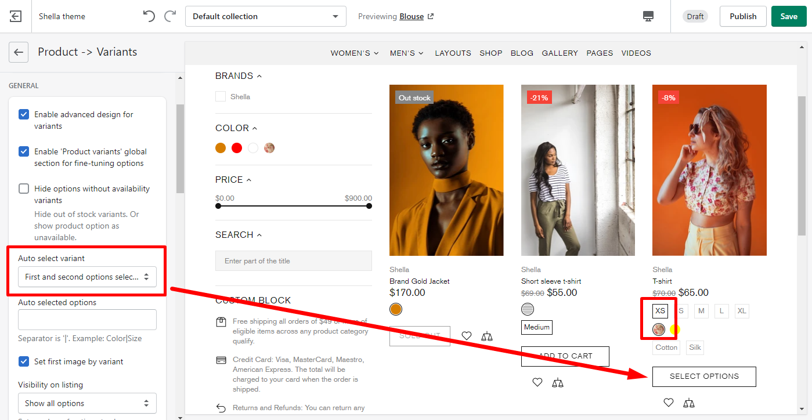
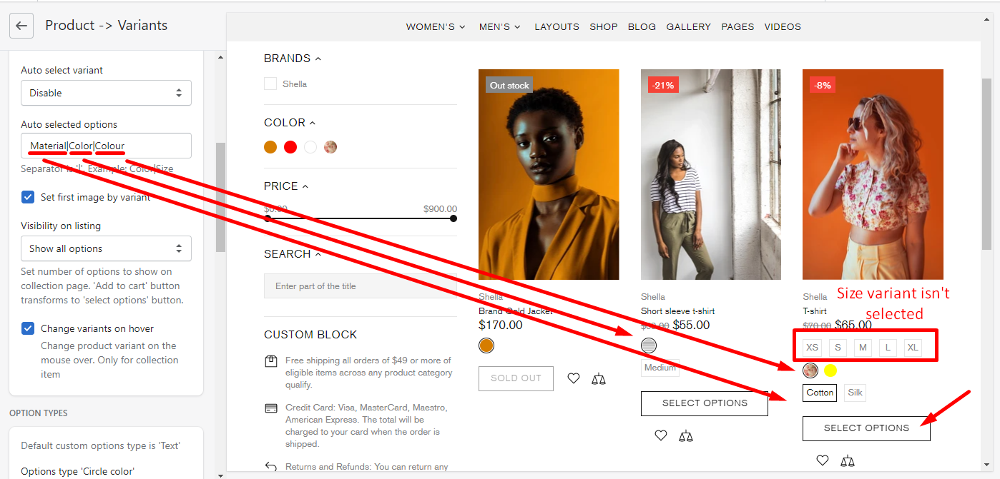
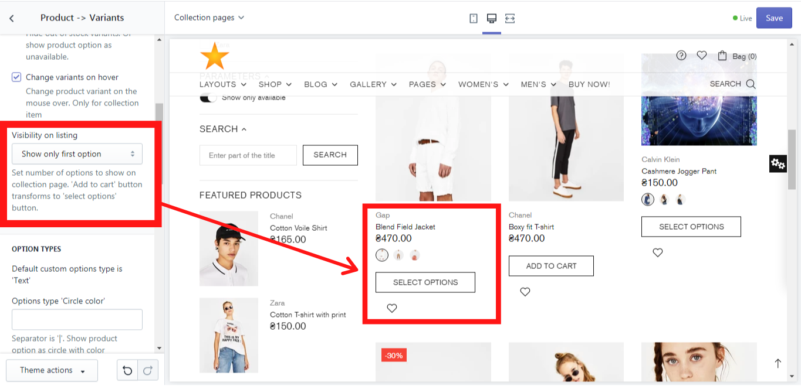
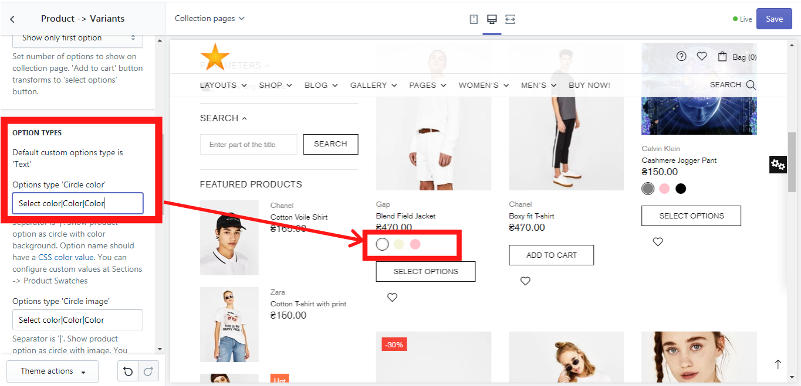
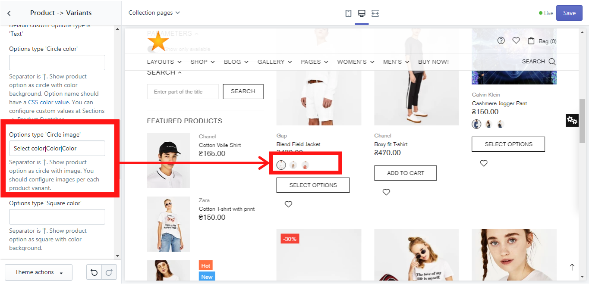
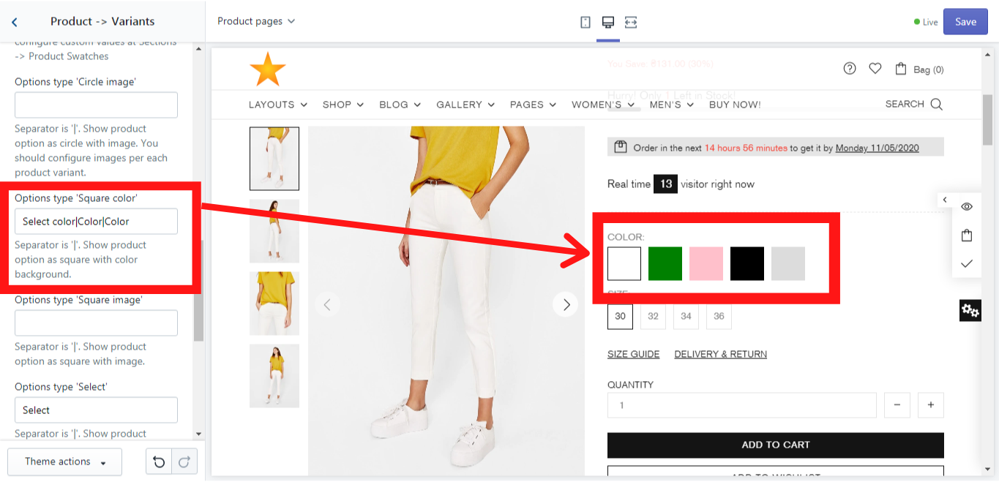
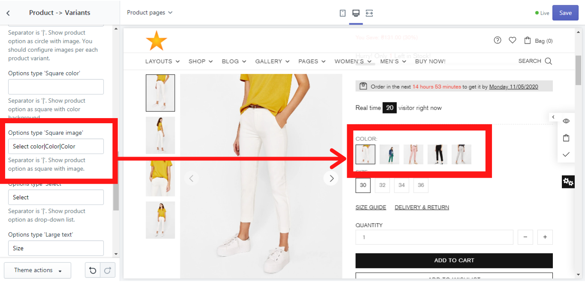
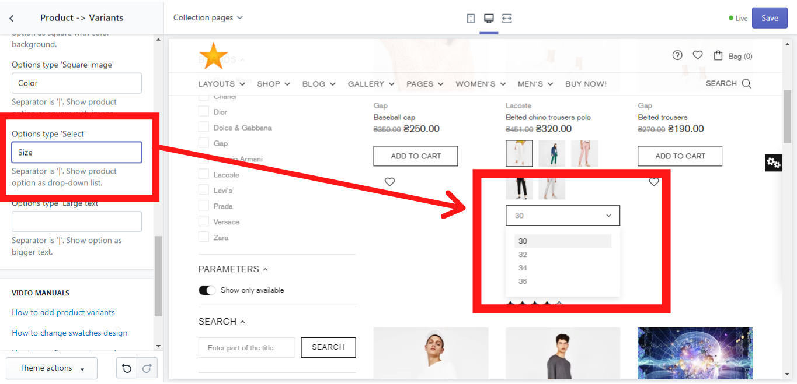
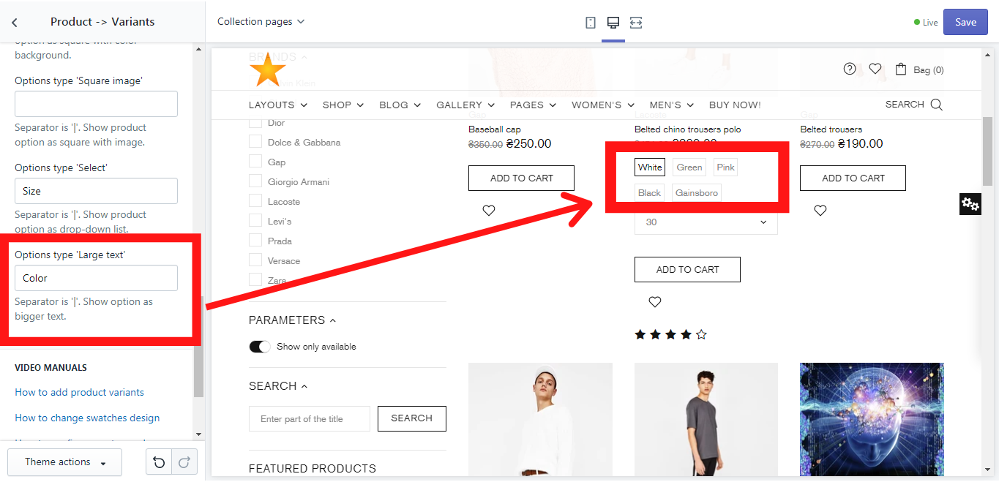

# Product -> Variants


**Theme settings -> Product -> Variants**




## General

### **Enable advanced design for variants**

&#x20;If you enable this option, the advanced design for the product variants (color and size) will be shown:

.png>)

### **Enable 'Product variants' global section for fine-tuning options**


**Please note**, this section will be available only with active “Enable advanced design for variants”.


&#x20;This option enables you to add a “Product variants” global section, where you can add and customize additional product´s content. Once you enable it, go to Sections and you will find this block:

.png>)

&#x20;How to customize this section, you can read [<mark style="color:blue;">**here**</mark>](https://mpithemes.gitbook.io/shella-shopify-theme/product-variants).

### **Hide options without availability variants**

&#x20;This option allows you to hide the product variants from the product page if they are out of stock or to show them as unavailable, e.g.: If a jacket is available in the sizes: 30, 32, 34, 36, 38 and all the jackets with the sizes 32 and 34 were sold out, these size variants will be hidden on the jacket's product page or shown as unavailable if you make for this product variant a dropdown menu (A dropdown menu can be done in Option types -> Option type “Select”).

### **Auto select variant**

&#x20;This option allows you to auto select product variants. If you select an option “**Enable**”, the “Add to cart” button will be shown for all products.

&#x20; Once you select one of the options: **“Only first option selected”**, **“First and second options selected”** or **“Disable”**, the “Add to cart” button will be changed to “Select options” button for the products that have more product variants. For e.g., if the product has Color, Size and Material product variants and you selected an option “First and second options selected”, the “Add to cart” button will be changed to “Select options” button, because this product has one more product variant.

### **Auto selected options**

&#x20;You can also decide what product variants to select automatically by filling in this field:

### **Set first image by variant on listing**

&#x20;By default, the product images are displayed in the same sequence as they were added in the backend. If you enable this option, the product images on collection page will be listed according to the product variant. For e.g., if you have the first product variant as unavailable (out of stock), it will be displayed the next product image for the product variant that is in stock.

### Set first image by variant on product page

&#x20;By default, the product images are displayed in the same sequence as they were added in the backend. If you enable this option, the product images on product page will be listed according to the product variant. For e.g., if you have the first product variant as unavailable (out of stock), it will be displayed the next product image for the product variant that is in stock.

### **Visibility on listing**

&#x20;Here you can decide which product variants should be shown on the collection page. Here are three options available:

* Show all options (Here all product options will be shown on the collection page, like color, size, and material);
* Show only first option (Here only a first product option will be shown on the collection page, e.g.: color. Once you choose this option, the button “Add to cart” transforms to the button “Select options”);
* Show first and second options (Here only a first and a second product option will be shown on the collection page, e.g.: color and size. Once you choose this option, the button “Add to cart” transforms to the button “Select options”).

Example of “Show only first option”:

### **Change variants on hover**

&#x20; This option allows you to change a product image when hover the mouse cursor over the product's swatch.


[<mark style="color:blue;">**VIEW DEMO**</mark>](https://shella-demo.myshopify.com/collections/all)<mark style="color:blue;">****</mark>


## Options types

&#x20; In this section, we will show you, how you can configure the option types for the product. You can show such product options as 'Text', 'Large Text', 'Circle color', 'Circle image', 'Square color', 'Square image', or 'Select' - a dropdown list.

### **Options type 'Circle color'**

&#x20;If you prefer the product´s color options to be shown as a circle color, choose this option. Please, use a separator '|' if needed.&#x20;


**IMPORTANT!** Make sure, that the option name has a **** [<mark style="color:blue;">**CSS color value**</mark>](https://www.w3schools.com/cssref/css\_colors.asp).

You can configure custom values in **“Product variants”** section. More information you can find **** [<mark style="color:blue;">**here**</mark>](https://mpithemes.gitbook.io/shella-shopify-theme/product-variants).


&#x20;In our example, we have used “Select color|Color|Color” to show you how the different option names can be written in one field using a separator “|”. This might be irrelevant for you if your product´s variant doesn't have different names in each product. In this case, you can simply write “Color” (your option name).\
&#x20;In order to enable the option type “Circle color”, simply write “Color” in the field for Option type ‘Circle color’ and you will get this:


****[<mark style="color:blue;">**VIEW DEMO**</mark>](https://shella-demo2.myshopify.com/products/belted-chino-trousers)<mark style="color:blue;">****</mark>


### **Options type 'Circle image'**

&#x20;If you prefer the product´s color options to be shown as a circle image, choose this option. Please use a separator '|' if needed. You should configure images per each product variant. In our example, we have used “Select color|Color|Color” to show you how the different option names can be written in one field using a separator “|”. This might be irrelevant for you if your product´s variant doesn´t have different names in each product. In this case, you can simply write “Color”.\
&#x20;In order to enable the option type “Circle image”, simply write “Color” in the field for Option type ‘Circle image’ and you will get this:


****[**VIEW DEMO**](https://shella-demo8.myshopify.com/products/belted-chino-trousers)****


### **Options type 'Square color'**

&#x20;If you prefer the product´s color options to be shown as a square color, choose this option. Please use a separator '|' if needed. Make sure, that the option name has a [<mark style="color:blue;">**CSS color value**</mark>](https://www.w3schools.com/cssref/css\_colors.asp). You can configure custom values in **“Product variants”** section.\
&#x20;In our example, we have used “Select color|Color|Color” to show you how the different option names can be written in one field using a separator “|”. This might be irrelevant for you if your product´s variant doesn't have different names in each product. In this case, you can simply write “Color”.\
&#x20;In order to enable the option type “Square color”, simply write “Color” in the field for Option type ‘Square color’ and you will get this:


****[<mark style="color:blue;">**VIEW DEMO**</mark>](https://shella-demo13.myshopify.com/products/belted-chino-trousers)<mark style="color:blue;">****</mark>


### **Options type 'Square image'**

&#x20;If you prefer the product´s color options to be shown as a square image, choose this option. Please use a separator '|' if needed. You should configure images per each product variant. In our example, we have used “Select color|Color|Color” to show you how the different option names can be written in one field using a separator “|”. This might be irrelevant for you if your product´s variant doesn´t have different names in each product. In this case, you can simply write “Color”.\
&#x20;In order to enable the option type “Square image”, simply write “Color” in the field for Option type ‘Square image’ and you will get this:


****[<mark style="color:blue;">**VIEW DEMO**</mark>](https://shella-demo9.myshopify.com/products/belted-chino-trousers)<mark style="color:blue;">****</mark>


### **Options type 'Select'**

&#x20;Here you can decide which option type will be shown as a combobox. In our example we will use the option “Size”:


<mark style="color:blue;">****</mark>[<mark style="color:blue;">**VIEW DEMO**</mark>](https://shella-demo11.myshopify.com/products/belted-chino-trousers)<mark style="color:blue;">****</mark>


### **Options type 'Large text'**

&#x20;This option allows you to show the product´s variants not as images, but as a text. In our example we show you how it works for “Color”. Just write “Color” in the proper field and save changes:


****[<mark style="color:blue;">**VIEW DEMO**</mark>](https://shella-demo15.myshopify.com/products/belted-chino-trousers)<mark style="color:blue;">****</mark>

