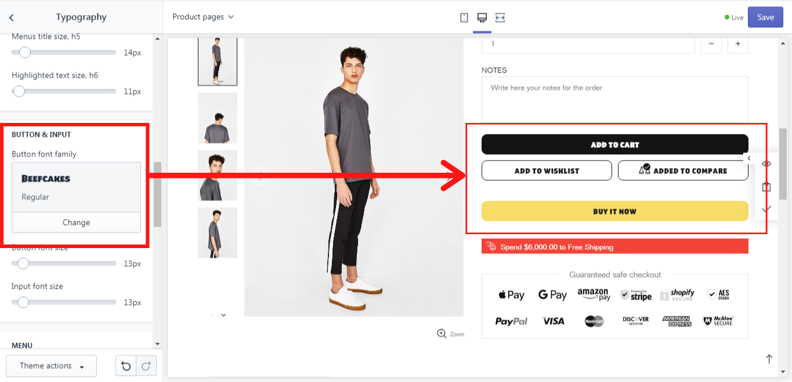

# Typography


**Theme settings -> Typography**


## Body

&#x20;In this section, you can change the font of the body’s content choosing the one you like from the **“Base font family”** list:

.png>)

&#x20;If you want to choose a different font for headings, buttons, inputs or menu, disable the option **“Apply font to all elements ignoring everything except alternate font”**:

.png>)

&#x20;In the dropdown list **“Load additional style”** , you can choose an additional style for the font family**:** Bold, Italic, Bold & italic, Bold italic. Choose “None” if you do not want to apply any style.

&#x20;On the **“Base font size”** scale from 10 to 60 px, you can choose the size of the base font.

## Heading

&#x20;Here you can customize the font for the headings in your store. In the **“Font family”** you can change the font of all your headings:

.png>)

&#x20;In the dropdown list **“Load additional style”** , you can choose an additional style for the font family**:** Bold, Italic, Bold & italic, Bold italic. Choose “None” if you do not want to apply any style.

&#x20;On the **“Promo box large text size, h1”** and **“Promo box text size, h2”** scales from 10 to 100 px you can change the size of the text in banners.

&#x20;We chose the Type #1 v1 (Text over the image) for the Promo box (Banner) in the "Layout" block. And changed the h1 to 44 px. And this is what we have got:

.png>)

&#x20;And for this example we chose the Type #1 v17 for the Promo box (Banner) in the "Layout" block:

.png>)

&#x20;On the **“Page title size, h3”** scale from 10 to 60 px you can change the size of the title on pages:

.png>)

&#x20;On the **“Section title size, h4”** scale from 10 to 60 px you can change the size of the section’s title on any page:

&#x20;On the **“Menus title size, h5”** scale from 10 to 60 px you can change the size of the menu’s title on any page:

&#x20;On the **“Highlighted text size, h6”** scale from 10 to 60 px you can change the size of the product title and product type in collections:

.png>)

## Button & Input

&#x20;In the **“Button font family”** you can change the font of the buttons:

&#x20;On the **“Button font size”** scale from 10 to 60 px you can change the size of the button text. On the **“Input font size”** scale from 10 to 60 px you can change the size of the input, e.g.: placeholder’s text:

## Menu

&#x20; In this section, you can change the font of the menu, simply select the proper one from the list in the **“Font family”:**

&#x20;On the **“First level font size”** scale from 10 to 60 px you can change the size of the menu text on the first level:

&#x20; ****  On the **“List font size”** scale from 10 to 60 px you can change the size of the font in the menu list:

&#x20;On the **“Title font size”** scale from 10 to 60 px you can change the size of the font in the titles of the menu:

&#x20;On the **“Mobile menu font size”** scale from 10 to 60 px you can change the menu font size for the mobile version.

## Alternative font family

&#x20;In this section, you can add the class 'ff-alternative' to any element to apply this font family.

&#x20;You can change the font of the element by choosing the one you like from the **“Font family”** list.

&#x20;In the dropdown list **“Load additional style”** , you can choose an additional style for the font family**:** Bold, Italic, Bold & italic, Bold italic. Choose “None” if you do not want to apply any style.

****
